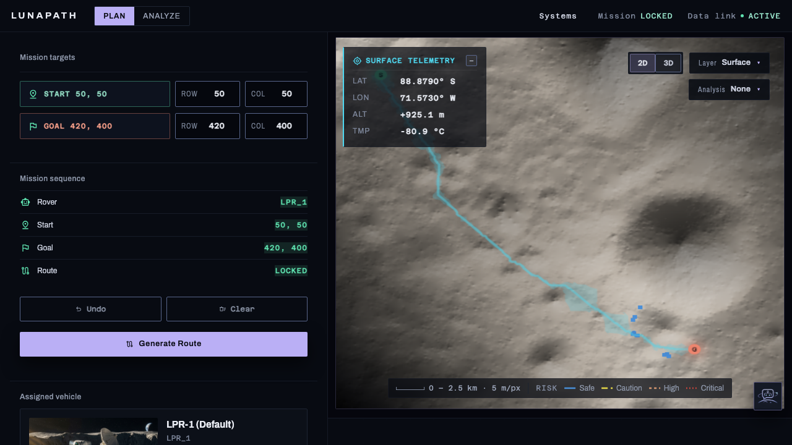
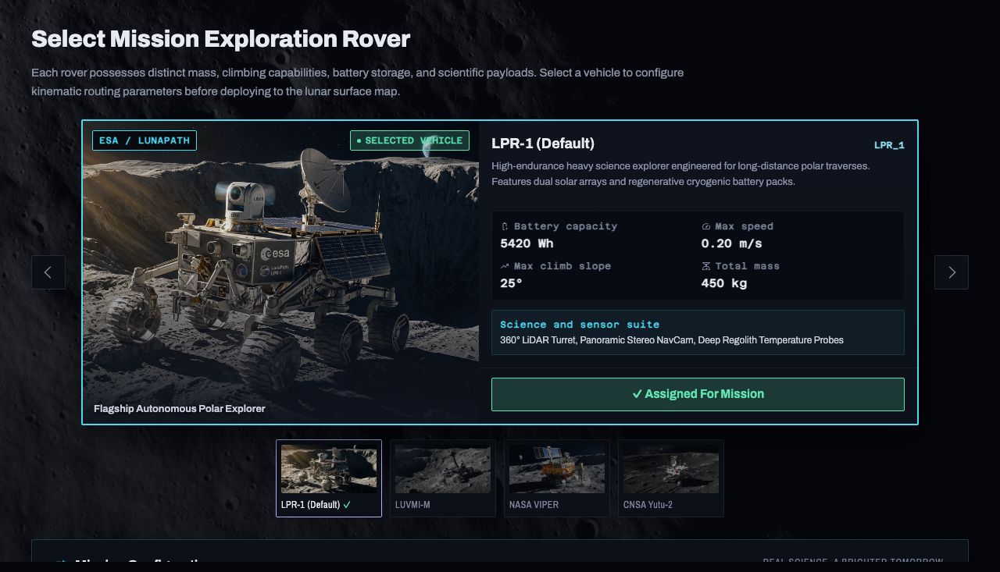
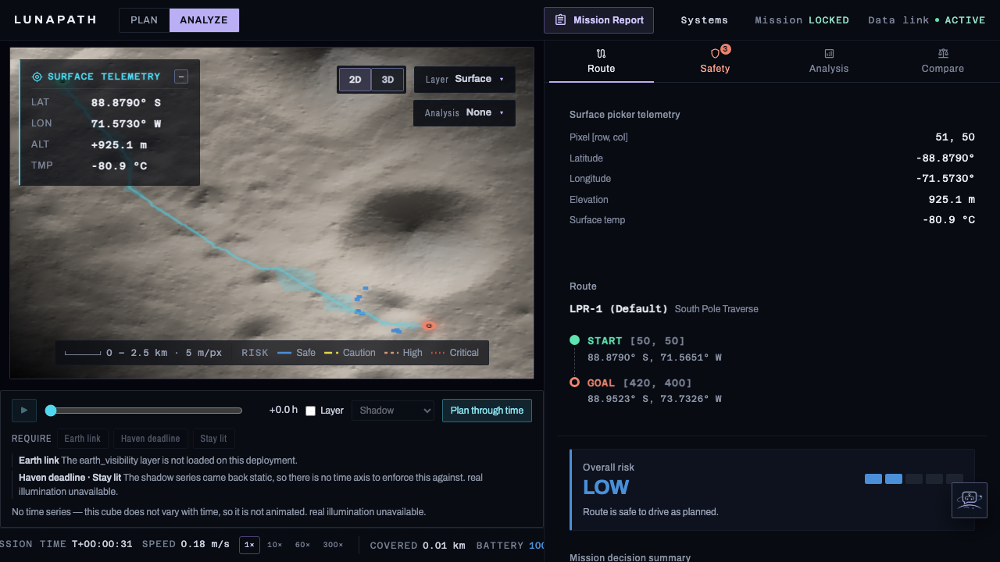
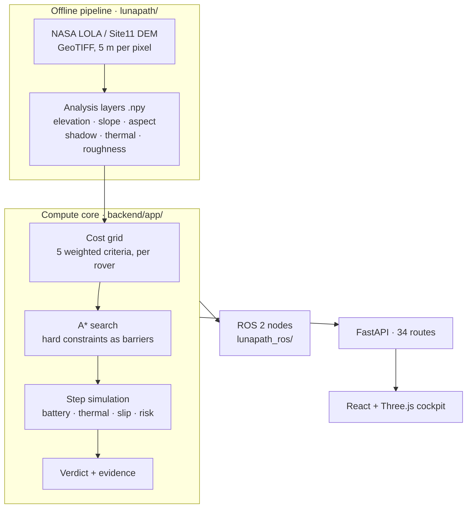
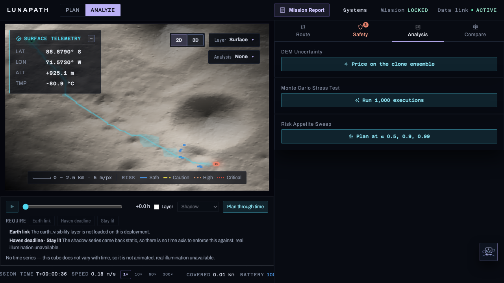
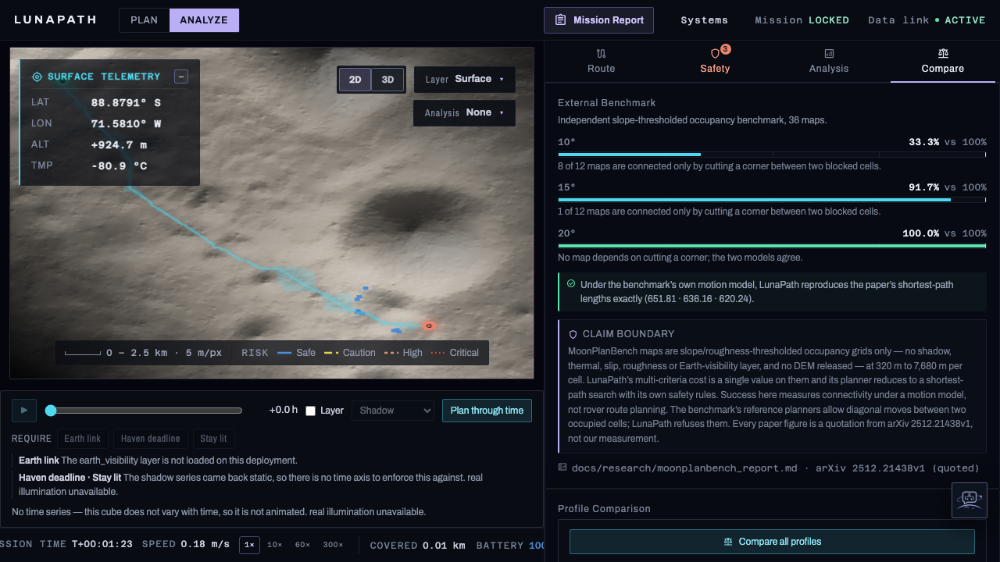

<div align="center">

# LunaPath

**Multi-criteria route planning for rovers at the lunar south pole.**

Pick a rover, pick two points on the Moon, and get a drivable route — with the
slope it climbs, the battery it spends, the shadow it crosses, and an honest
label on every number saying whether it was *measured*, *modelled*, or *assumed*.

[](https://www.python.org/)
[](https://fastapi.tiangolo.com/)
[](https://react.dev/)
[](https://www.typescriptlang.org/)
[](https://threejs.org/)
[](https://docs.ros.org/)
[](#testing)
[](LICENSE)

🇹🇷 **[Türkçe README](README.tr.md)**



</div>

---

## Table of contents

- [The problem](#the-problem)
- [What LunaPath does](#what-lunapath-does)
- [Quick start](#quick-start)
- [The interface](#the-interface)
- [How it works](#how-it-works)
- [Features](#features)
- [The honesty ladder](#the-honesty-ladder)
- [Data and provenance](#data-and-provenance)
- [API reference](#api-reference)
- [Optional caches](#optional-caches-what-unlocks-what)
- [ROS 2 integration](#ros-2-integration)
- [Project layout](#project-layout)
- [Testing](#testing)
- [What LunaPath is not](#what-lunapath-is-not)
- [Team](#team)

---

## The problem

The lunar south pole is the destination of every serious mission this decade —
Artemis, VIPER, Chang'e. It is also the hardest place on the Moon to drive.

The Sun never rises more than a few degrees above the horizon, so shadows are
kilometres long and move all day. A crater rim that is sunlit at 09:00 is a
−180 °C trap at 15:00. Battery is finite, the slope limit is a hard constraint,
and a rover that stops in the wrong shadow does not start again.

So "what is the shortest path?" is the wrong question. The right one is:

> **Which route gets there without running out of battery, tipping over,
> freezing, or getting stuck — and how confident are we in that answer?**

LunaPath answers that question, and — this is the part that matters — it tells
you how much to trust each part of the answer.

---

## What LunaPath does

LunaPath turns a NASA elevation map of the lunar south pole into a set of
analysis layers, searches them for a route that satisfies a specific rover's
physical limits, then simulates driving that route step by step.

```
NASA DEM  ─▶  analysis layers  ─▶  cost grid  ─▶  A* search  ─▶  simulation  ─▶  verdict
(5 m/px)      slope, shadow,       weighted      route that     battery,      safe /
              thermal, roughness   per rover     obeys limits   time, risk    unsafe
```

A run through the API on the loaded Site11 terrain, start `[50, 50]` to
goal `[420, 400]`:

| Result | Value |
|---|---|
| Route length | 2.84 km, 456 waypoints |
| Elapsed time | 4.57 hours |
| Battery on arrival | 84.94 % (never dipped below) |
| Steepest step | 13.11° (rover limit: 25°) |
| Shadow exposure | 2.76 (accumulated) |
| Critical steps | 0 |

That is a complete mission answer, not a line on a map.

---

## Quick start

**Prerequisites:** Python 3.11+, Node.js 18+. `rasterio` pulls in GDAL, which
installs differently per OS — on macOS `brew install gdal` first if pip struggles.

```bash
git clone https://gitlab.com/seng2026/ASTROHackathon.git
cd ASTROHackathon
```

**1. Backend**

```bash
python -m venv .venv && source .venv/bin/activate      # Windows: .venv\Scripts\activate
pip install -r backend/requirements.txt -r lunapath/requirements.txt
cd backend && uvicorn app.main:app --reload --host 0.0.0.0 --port 8000
```

API docs at **http://127.0.0.1:8000/docs**

**2. Frontend** (new terminal)

```bash
cd frontend && npm install && npm run dev
```

App at **http://127.0.0.1:3000** — Vite proxies `/api` to port 8000, so no
CORS configuration is needed in development.

**3. Check it is alive**

```bash
curl http://127.0.0.1:8000/api/health
# {"status":"ok","version":"0.3.0","dem_loaded":true,"grid_shape":[500,500]}
```

If `dem_loaded` is `false`, the backend started without processed grids —
see [Optional caches](#optional-caches-what-unlocks-what).

<details>
<summary><b>Optional: the AI mission assistant</b></summary>

Everything works without this; the chat panel simply reports that it is not
configured.

```bash
cp .env.example .env      # Windows: copy .env.example .env
```

Fill in `LUNAPATH_OPENAI_API_KEY`, then start the backend with the env file:

```bash
uvicorn app.main:app --reload --host 0.0.0.0 --port 8000 --env-file ../.env
```

The app does **not** read `.env` on its own — without `--env-file`, only
`/api/ai/chat` fails, and it fails with a clear configuration error rather
than a silent fallback. The key is read in the server process only; the
browser bundle contains no key and no OpenAI client.

</details>

---

## The interface

The app is one console with two modes, and every screen is addressable by URL,
so the back button works and a refresh returns you where you were.

| URL | Screen |
|---|---|
| `/` | Landing |
| `/?stage=hangar` | Fleet hangar — choose the rover |
| `/?stage=planner` | Cockpit, **PLAN** — map and route generation |
| `/?stage=analysis` | Cockpit, **ANALYZE** — the report on the route you generated |

Route state is deliberately not carried in the URL, so opening
`/?stage=analysis` in a fresh tab lands on PLAN — there is no route to analyse yet.

### Hangar — pick the vehicle



Four rovers, each with real published figures: **LPR-1** (the default,
450 kg flagship), **LUVMI-M** (40 kg micro-rover), **NASA VIPER**, and
**CNSA Yutu-2**. Mass, top speed, battery capacity and slope limit are not
decoration — they change which routes exist.

### PLAN — draw the traverse

Click start and goal on the map (or type grid coordinates), then
**Generate Route**. The map draws the route coloured by risk, and the HUD
reads out latitude, longitude, elevation and surface temperature under the
cursor. Toggle between the 2-D map and a 3-D terrain view.

### ANALYZE — read the verdict



The mission report has four tabs — **Route**, **Safety**, **Analysis**,
**Compare** — and a plain-language verdict at the top: *"Route is safe to
drive as planned."* Anything the deployment cannot evaluate says so explicitly
instead of quietly returning zero.

---

## How it works



Two things are worth noticing in that diagram.

**The compute core has two consumers.** The FastAPI service and the ROS 2
nodes both import the same planner, cost engine and simulator directly — the
ROS side is not an HTTP client wrapping the web app. The physics is written
once.

**Cost is computed per rover, not once.** A 40 kg micro-rover and a 450 kg
flagship see different cost grids over the same terrain, because the slope
that is trivial for one is a hard stop for the other.

### The cost model

Each cell gets a cost from five weighted criteria (`COST_MODEL_ID`
`weighted_cell_cost_shadow_aware_energy_slip_roughness_v5`):

| Criterion | Weight key | What it penalises |
|---|---|---|
| Slope | `w_slope` | Steep ground: slow, energy-hungry, and past the limit, impassable |
| Energy | `w_energy` | Cells where the drive costs more than the solar panels recover |
| Shadow | `w_shadow` | Time spent out of sunlight — no charging, and it gets cold |
| Thermal | `w_thermal` | Surface temperature outside the rover's operating envelope |
| Roughness | `w_roughness` | Measured rock and boulder density (LOLA LDRM) |

Weights are **not normalised** — they are direct multipliers, so setting
`w_shadow` to twice `w_slope` genuinely means shadow matters twice as much.
Four preset mission profiles ship with the app:

| Profile | Behaviour |
|---|---|
| **Balanced Recon** | Weighs every risk evenly. The default. |
| **Energy Saver** | Accepts a longer route to protect the battery. |
| **Fast Recon** | More aggressive; prefers the shorter route. |
| **Shadow Traverse** | Crossing shadow is unavoidable; thermal safety is critical. |

Hard limits (slope, lateral slope, minimum state of charge) are not weights.
They enter the search as logarithmic barriers, so the planner refuses to
return a route that violates them rather than returning an expensive one.

---

## Features

### Planning

| Feature | What it means |
|---|---|
| **A\* route planning** | Finds the lowest-cost route on the five-criterion grid. Refuses corner-cutting between two blocked cells — a real rover cannot drive through the gap. |
| **4-D planning** (`/api/plan-4d`) | Adds time. The Sun moves, so shadow moves; a route that is safe at 09:00 may not be at 15:00. Searches *x, y, time* together, and can wait in place for the light. |
| **Replanning** (`/api/replan`) | Evaluates trigger conditions mid-drive (battery below plan, pose drifted, entrenchment) and replans only if one fires. |
| **Multi-profile compare** | Plans the same start/goal under all four mission profiles side by side, with constraint margins per result. |
| **Obstacle injection** | Mark cells blocked and replan around them. |

### Physics and environment

| Feature | What it means |
|---|---|
| **Real solar geometry** | NAIF SPICE ephemeris gives true Sun position for a given UTC — not a synthetic day/night cycle. |
| **Regolith thermal model** | `heat1d` integrates heat diffusion into lunar soil with slope and aspect, giving real surface temperature rather than a lookup table. |
| **Illumination corridor** | Finds routes that stay continuously lit — the sun-synchronous traverse strategy real polar missions use. |
| **Earth visibility** | When the rover can see Earth, which is when it can talk to it. Communication windows along the route. |
| **Safe havens** | Locations the rover can reach and survive in until the light returns. |
| **Slip model** | Wheels slip on regolith, and slip costs time and energy. Anchored to Yutu-2's measured slip on Chang'e-4 and VIPER's design constraint. |
| **Thermal dwell** | How long the rover can sit in one place before its internals leave the safe envelope. |
| **Solar panel geometry** | Opt-in: charging power can follow the incidence angle between the array and the Sun, not just "is it lit". At 1.5 degrees of polar Sun that is the difference between a body-mounted array that can turn and a flat one. Off by default, so every existing number is unchanged. |
| **Cold battery and hibernation** | Opt-in, three switches, **all off by default**: a battery that delivers less of its charge when it is cold (zero below the 200 K freeze point NASA Glenn measured on 18650 cells), a survival heater whose power follows the temperature difference through NASA JSC's own Stefan-Boltzmann law instead of the shadow ratio, and a HIBERNATE action — sleep through the dark, wake at first light on a dawn pre-heat run from the solar array. The darkness endurance stops being one constant per rover. With the switches off every existing number is unchanged. |

### Risk and uncertainty



| Feature | What it means |
|---|---|
| **DEM uncertainty** | The elevation map itself has error. LunaPath plans across an ensemble of NASA's published clones of the same terrain (20 by default, up to 100) and reports how much the answer moves. |
| **Monte Carlo stress test** | Runs the mission 1,000 times with perturbed conditions and reports the distribution, not one optimistic number. |
| **Risk appetite (CVaR)** | A slider from α = 0.5 to 0.999. At high α the planner optimises the *tail* of the distribution — the bad days — instead of the average. |
| **Survival policy** | Backward value iteration over a coarse grid gives `P_safe` per cell and a recovery action: if this goes wrong here, what do I do? |
| **Formal safety monitor** | Requirements written in FRETISH and Signal Temporal Logic, checked against the plan with `rtamt`. Not a heuristic — a formal property check. |

### Evidence and explainability

| Feature | What it means |
|---|---|
| **Per-cell cost breakdown** | Click any cell: see exactly how much each of the five criteria contributed to its cost. No black box. |
| **Validity labels everywhere** | Every layer carries `MEASURED` / `MODEL` / `DERIVED` / `SYNTHETIC`. See [the honesty ladder](#the-honesty-ladder). |
| **External benchmark** | Scored against MoonPlanBench, an independent published benchmark — including where LunaPath scores *worse* and why. |
| **AI mission assistant** | A Turkish-language chat layer grounded in the actual plan data. It is wired so it cannot invent numbers: the grounding layer matches Turkish morphology against the real response fields and blocks fabricated figures. |
| **Bilingual mission report** | The generated report reads in English or Turkish, translated as whole sentences rather than assembled from fragments. |

### The benchmark, and its boundary



This screen is the project's character in one frame. LunaPath reproduces the
MoonPlanBench paper's shortest-path lengths **exactly** (651.81 / 636.16 /
620.24 cells) — and then, right below the result, a **CLAIM BOUNDARY** panel
explains why that comparison proves less than it appears to: the benchmark
maps are occupancy grids only, with no shadow, thermal, slip or roughness
layer, so LunaPath's five-criterion cost collapses to a single value there.

Most projects show the number. This one shows the number and the reason not
to over-read it.

---

## The honesty ladder

This is the idea the rest of the project is built around.

Space software fails when a modelled number is mistaken for a measured one.
So in LunaPath every layer, every constant and every derived figure carries a
label, ranked:

```
SYNTHETIC  <  DERIVED  <  MODEL  <  MEASURED
```

| Label | Meaning | Example |
|---|---|---|
| `MEASURED` | From an instrument. A real spacecraft observed this. | LOLA roughness, PSR mask, the DEM itself |
| `MODEL` | Physics we ran, calibrated against published measurements. | Regolith temperature via `heat1d`, the slip curve |
| `DERIVED` | Computed from the above by arithmetic. | Slope from elevation, cost from layers |
| `SYNTHETIC` | A stand-in. Real data was unavailable. | The elevation-proxy shadow estimate |

The label travels all the way to the browser: API responses carry
`layer_validity`, binary layer responses carry an `X-Layer-Validity` header,
and the UI shows provenance next to the value.

Two rules follow from this, and the codebase keeps both:

1. **A derived value can never be labelled better than its worst input.**
   A cost grid built on a `SYNTHETIC` shadow layer is not `MEASURED`, no
   matter how good the arithmetic was.
2. **Unavailable is a valid answer.** When a feature has no data, it says
   `unavailable` and explains what is missing. It does not return a zero
   that looks like a measurement.

Assumptions that are not sourced from anywhere are marked `assumption:` in
the catalogue, so a reader can find every number nobody has verified.

---

## Data and provenance

| Source | Product | Used for |
|---|---|---|
| **NASA PGDA** | Site11 south pole DEM, 5 m/px | Base elevation, slope, aspect |
| **NASA PGDA (product 90)** | LOLA LDRM roughness + LPSR PSR mask | Measured roughness, permanently shadowed regions |
| **NASA PGDA (product 78)** | 100 DEM clones of Site11 | Elevation uncertainty ensemble |
| **NAIF SPICE** | Generic kernels | Sun and Earth geometry for a given UTC |
| **Yale BSC5** | Bright Star Catalogue, 9,096 stars | The real sky in the 3-D view |
| **PDS Geosciences** | Diviner Polar Resource Product (`LRO-L-DLRE-5-PRP-V2.0`) | Thermal validation reference (C5) |
| **MoonPlanBench** | 36 occupancy maps (Chancán et al. 2025) | Independent external benchmark |

Licensing is taken seriously: the project is MIT, so every dependency and
bundled data set is verified MIT or BSD, and share-alike sources are rejected
even when convenient. The HYG star database was rejected for exactly this
reason — it is CC BY-SA — in favour of the public-domain BSC5. Details in
[`docs/DATA_LICENSES.md`](docs/DATA_LICENSES.md).

Large data is deliberately **not** committed: DEMs, `.npy` grids and SPICE
kernels are hundreds of megabytes and are fetched or generated locally.

---

## API reference

34 routes, all documented interactively at `/docs`. Grouped by what they do:

<details>
<summary><b>Planning</b> — 8 routes</summary>

| Method | Route | Purpose |
|---|---|---|
| `POST` | `/api/plan` | Plan a route and simulate driving it |
| `POST` | `/api/plan-4d` | Time-expanded planning (Sun moves) |
| `POST` | `/api/plan-multi` | Plan under selected mission profiles |
| `POST` | `/api/compare` | Plan under all four profiles, side by side |
| `POST` | `/api/replan` | Evaluate triggers, replan if one fires |
| `POST` | `/api/risk-sweep` | Same route planned at several risk appetites |
| `POST` | `/api/pareto` | Weight-simplex sweep: the routes nothing else beats, plus why the surviving set is so small. Measured on Site11 it collapses to 1-4 routes whose spread is ~94x narrower than the model's own uncertainty -- not a Pareto front, and the response says so (`completeness: no_guarantee`). |
| `POST` | `/api/safety-check` | Run the formal safety monitor over a supplied telemetry trace |
| `POST` | `/api/stress-test` | Monte Carlo the mission |

</details>

<details>
<summary><b>Environment layers</b> — 13 routes</summary>

| Method | Route | Purpose |
|---|---|---|
| `GET` | `/api/terrain` | 3-D scene manifest |
| `GET` | `/api/layers/{name}` | One analysis layer (JSON or raw float32) |
| `GET` | `/api/illumination-series` | Shadow and temperature over time |
| `GET` | `/api/illumination-corridor` | Continuously-lit corridor cube |
| `GET` | `/api/earth-series` | Earth visibility over time |
| `GET` | `/api/comm-window` | Communication window for a cell |
| `GET` | `/api/thermal-envelope` | Operating envelope matrix |
| `GET` | `/api/thermal-dwell` | Tolerable dwell time per cell |
| `GET` | `/api/panel-gain` | Solar panel cos i gain over time |
| `GET` | `/api/battery-model` | Cold-capacity curve, heater calibration, hibernation |
| `GET` | `/api/survival` | `P_safe` layer |
| `GET` | `/api/safe-haven` | Reachable survivable locations |
| `GET` | `/api/lidar-scan` | Virtual LiDAR sweep of the DEM |
| `GET` | `/api/psr-validation` | PSR mask vs. computed shadow agreement |

</details>

<details>
<summary><b>Catalogue, telemetry and data loading</b> — 13 routes</summary>

| Method | Route | Purpose |
|---|---|---|
| `GET` | `/api/health` | Service status, whether a DEM is loaded |
| `GET` | `/api/rovers` | Rover catalogue with full physical parameters |
| `GET` | `/api/profiles` | Mission profile catalogue |
| `GET` | `/api/scenarios` | Scenario catalogue |
| `POST` | `/api/scenarios/{id}/load` | Load a scenario |
| `GET` | `/api/reference-missions` | Published real-mission figures for comparison |
| `GET` | `/api/cell-telemetry` | Everything known about one cell, with cost breakdown |
| `GET` | `/api/uncertainty-series` | Uncertainty over the clone ensemble |
| `POST` | `/api/dem-uncertainty` | Price a route across the clone ensemble |
| `POST` | `/api/load-dem` | Derive grids from a GeoTIFF |
| `POST` | `/api/load-preprocessed` | Load existing `.npy` grids |
| `POST` | `/api/pose` | Evaluate a pose estimate against the corridor |
| `POST` | `/api/ai/chat` | Ask the mission assistant |

</details>

---

## Optional caches: what unlocks what

A fresh clone has the source and the raw DEMs but none of the derived data.
Twelve features answer `unavailable` until their cache is built — which is the
correct behaviour, not a bug. One command builds everything:

```bash
python scripts/setup_caches.py            # everything, in dependency order
python scripts/setup_caches.py --list     # show the steps
python scripts/setup_caches.py --skip-grids            # keep existing grids
python scripts/setup_caches.py --only roughness,clones # just these
```

| Step | Builds | Unlocks | Network |
|---|---|---|---|
| `grids` | P1 analysis layers (**overwrites**) | Everything |  |
| `horizon` | Horizon cube | 4-D planning, illumination corridor, skyline |  |
| `earth` | Earth visibility cache | Comm windows, Earth-link constraint |  |
| `roughness` | LOLA roughness + PSR mask | 5th cost criterion, PSR validation | ✔ |
| `clones` | NASA DEM clone ensemble | Uncertainty, CVaR risk appetite | ✔ |
| `thermal` | Thermal envelope (heat1d) | Thermal dwell constraint |  |
| `diviner` | Diviner Polar Resource Product | Thermal validation report (C5) | ✔ |
| `benchmark` | MoonPlanBench maps | External benchmark comparison | ✔ |
| `rtamt` | STL cross-check engine (optional) | Second opinion on the safety monitor | ✔ |

Each step runs as its own process, so one failure — a download that times
out, a product that moved — does not take the rest down.

**Thermal validation (C5) is off unless its cache exists.** Without
`diviner_prp.npz`, `scripts/validate_thermal.py` writes nothing and exits 2,
and `test_thermal_validation_real_grid.py` skips — deliberately, because a
validation that invents its reference is worse than one that does not run.
Build it with `python scripts/setup_caches.py --only diviner` (605 MB from
PDS), then `python scripts/validate_thermal.py`.

**SPICE kernels** are separate and needed for real Sun/Earth geometry:

```bash
python lunapath/src/fetch_kernels.py      # a few hundred MB, run once
```

Without them, `/api/comm-window` and other ephemeris-backed routes fail.

---

## ROS 2 integration

The planner runs as ROS 2 nodes, importing the compute core directly rather
than calling the web API.

| Node | Role |
|---|---|
| `planner_node` | Serves the `PlanTraverse` action |
| `grid_publisher` | Publishes analysis layers as ROS topics |
| `pose_monitor` | Subscribes to `nav_msgs/Odometry`, checks pose against the corridor |
| `safety_monitor_node` | Runs the formal safety monitor live |

Custom messages: `Corridor`, `MissionWeights`, `PlanMetrics`, `ReplanTrigger`,
plus the `PlanTraverse` action. A Jazzy container is provided at
[`docker/ros2-jazzy.Dockerfile`](docker/ros2-jazzy.Dockerfile). Setup guide:
[`docs/ROS2_SETUP.md`](docs/ROS2_SETUP.md).

---

## Project layout

```
ASTROHackathon/
├── backend/          FastAPI service + compute core (57 modules, ~32k lines)
│   ├── app/          Planner, cost engine, physics, AI grounding
│   └── test_*.py     100 test files
├── frontend/         React + TypeScript + Three.js (~46k lines)
│   └── src/features/ 35 self-contained feature modules
├── lunapath/         Offline DEM pipeline, virtual LiDAR, SPICE kernel fetch
├── lunapath_ros/     ROS 2 nodes
├── lunapath_msgs/    ROS 2 message and action definitions
├── scripts/          Cache builders and measurement report generators
├── rovers/           Rover 3-D models (GLB)
├── docs/             Research notes, reference documents, measurement reports
└── docker/           ROS 2 Jazzy container
```

The frontend's `features/` directory is worth a note: each feature is
self-contained and registers itself into a named UI slot through
`features/registry.ts`, rather than being wired in by a parent component.
Shared seams are explicit (`src/intent/`, `src/i18n/`), so a feature can be
removed without unravelling the rest.

---

## Testing

```bash
cd backend && pytest              # 2,133 tests
cd frontend && npm test           # 427 tests
cd frontend && npm run typecheck  # strict TypeScript
cd frontend && npm run lint       # zero warnings allowed
```

The backend suite is not a smoke test. It checks physics against published
figures, validity labels against their inputs, API contracts against the
frontend's expectations, and the AI grounding layer against attempts to make
it fabricate numbers.

The measurement reports under [`docs/research/`](docs/research/) are generated
by the scripts in `scripts/` and record before/after numbers for each major
feature — the slip calibration, the risk sweep, the recovery policy, the
thermal dwell envelope.

---

## What LunaPath is not

Stating this clearly is part of the design.

**It is not an autonomous navigation system.** It is a ground-segment tool
that plans global routes from orbital data. It does not run on the rover, and
real-time obstacle avoidance is out of scope. Maturity comparison:
[`docs/research/09_olgunluk_kiyaslama.md`](docs/research/09_olgunluk_kiyaslama.md).

**It does not produce odometry — it consumes it.** There is no SLAM, no visual
odometry, no odometry library. `backend/app/pose.py` defines the input
contract any odometry stack plugs into; on the ROS side that is a
`nav_msgs/Odometry` subscription. `skyline.py` is a feasibility proof that
drift-free absolute position *can* be recovered from horizon matching, and it
returns an `ambiguity_ratio` rather than pretending the match is always
reliable.

**LiDAR is a power budget line, not perception.** A real LiDAR resolves
sub-metre rocks; the 5 m/px orbital DEM cannot. So LiDAR enters the planner
as continuous power and heater draw (`sensor_payload.py`), while the 3-D view
runs a 360°, 16-channel local LiDAR simulation over metre-scale rocks to make
that boundary visible and testable. That point cloud does not alter the
global route.

**The slip model is not calibrated for polar regolith.** It is anchored to
Yutu-2's measured slip and VIPER's design constraint and labelled `MODEL`.
Transferred anchors are marked `assumption:` in the catalogue.

---

## Team

**Tuna Deniz** · **Ahmet Karakoyun** · **Göktuğ Tabak** · **Oğuzhan Tarhan** · **Berke Kuş**

## Further reading

- [`docs/archive/lunapath_referans_belgesi_2.md`](docs/archive/lunapath_referans_belgesi_2.md) — formulas, constants, cost model
- [`docs/BACKEND_ENVANTER.md`](docs/BACKEND_ENVANTER.md) — full backend inventory audit
- [`docs/research/`](docs/research/) — 32 research and measurement documents
- [`docs/ROS2_KULLANIM_KILAVUZU.md`](docs/ROS2_KULLANIM_KILAVUZU.md) — ROS 2 usage guide

## License

MIT — see [LICENSE](LICENSE).

---

<div align="center">
<sub>

Built for a hackathon. This is a demonstration and a research prototype, not
flight software — it does not replace real mission analysis. Respect the
licence and usage terms of every space data set you load into it.

</sub>
</div>
