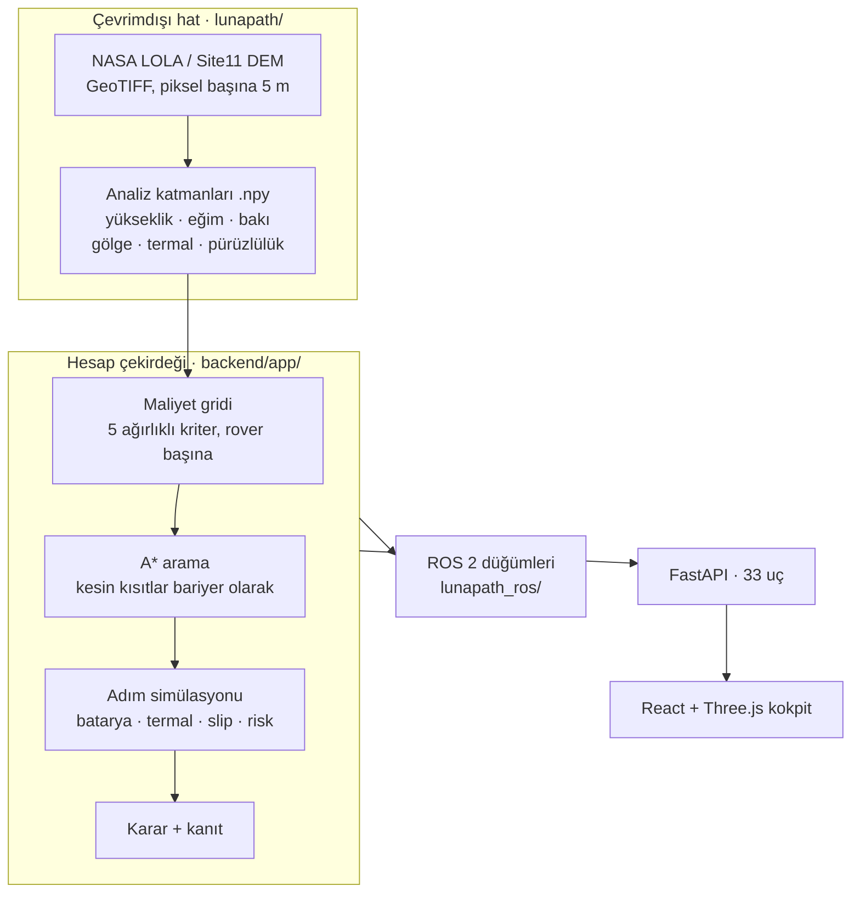

<div align="center">

# LunaPath

**Ay güney kutbunda rover'lar için çok kriterli rota planlama.**

Bir rover seçin, Ay üzerinde iki nokta seçin; sürülebilir bir rota alın —
tırmandığı eğim, harcadığı batarya, geçtiği gölge ve her sayının yanında
onun *ölçülmüş* mü, *modellenmiş* mi, yoksa *varsayılmış* mı olduğunu
söyleyen dürüst bir etiketle.

[](https://www.python.org/)
[](https://fastapi.tiangolo.com/)
[](https://react.dev/)
[](https://www.typescriptlang.org/)
[](https://threejs.org/)
[](https://docs.ros.org/)
[](#testler)
[](LICENSE)

🇬🇧 **[English README](README.md)**


</div>

---

## İçindekiler

- [Problem](#problem)
- [LunaPath ne yapar](#lunapath-ne-yapar)
- [Hızlı başlangıç](#hızlı-başlangıç)
- [Arayüz](#arayüz)
- [Nasıl çalışır](#nasıl-çalışır)
- [Özellikler](#özellikler)
- [Dürüstlük merdiveni](#dürüstlük-merdiveni)
- [Veri ve köken](#veri-ve-köken)
- [API referansı](#api-referansı)
- [İsteğe bağlı önbellekler](#i̇steğe-bağlı-önbellekler-hangisi-neyi-açar)
- [ROS 2 entegrasyonu](#ros-2-entegrasyonu)
- [Proje yapısı](#proje-yapısı)
- [Testler](#testler)
- [LunaPath ne değildir](#lunapath-ne-değildir)
- [Ekip](#ekip)

---

## Problem

Ay'ın güney kutbu bu on yılın her ciddi görevinin hedefi — Artemis, VIPER,
Chang'e. Aynı zamanda Ay'da sürüş için en zor yer.

Güneş ufkun birkaç derece üstüne çıkmaz, bu yüzden gölgeler kilometrelerce
uzundur ve gün boyu yer değiştirir. 09:00'da güneş alan bir krater kenarı
15:00'te −180 °C'lik bir tuzaktır. Batarya sınırlıdır, eğim limiti kesin bir
kısıttır ve yanlış gölgede duran bir rover bir daha hareket etmez.

Yani "en kısa yol hangisi?" yanlış sorudur. Doğrusu şudur:

> **Hangi rota bataryayı tüketmeden, devrilmeden, donmadan ve saplanmadan
> hedefe ulaştırır — ve bu cevaba ne kadar güvenebiliriz?**

LunaPath bu soruyu cevaplar ve — asıl önemli olan kısım — cevabın her
parçasına ne kadar güvenilmesi gerektiğini de söyler.

---

## LunaPath ne yapar

LunaPath, Ay güney kutbunun NASA yükseklik haritasını analiz katmanlarına
çevirir, belirli bir rover'ın fiziksel limitlerini sağlayan bir rota için bu
katmanları arar, sonra o rotayı adım adım sürüyormuş gibi simüle eder.

```
NASA DEM  ─▶  analiz katmanları ─▶  maliyet ─▶  A* arama  ─▶  simülasyon ─▶  karar
(5 m/px)      eğim, gölge,          rover        limitlere    batarya,      güvenli /
              termal, pürüzlülük    başına       uyan rota    süre, risk    değil
```

Yüklü Site11 arazisinde API üzerinden bir koşum, başlangıç `[50, 50]`,
hedef `[420, 400]`:

| Sonuç | Değer |
|---|---|
| Rota uzunluğu | 2,84 km, 456 ara nokta |
| Geçen süre | 4,57 saat |
| Varışta batarya | %84,94 (hiç altına inmedi) |
| En dik adım | 13,11° (rover limiti: 25°) |
| Gölge maruziyeti | 2,76 (birikimli) |
| Kritik adım | 0 |

Bu, haritadaki bir çizgi değil, eksiksiz bir görev cevabıdır.

---

## Hızlı başlangıç

**Önkoşullar:** Python 3.11+, Node.js 18+. `rasterio` GDAL'a bağlıdır ve
kurulumu işletim sistemine göre değişir — macOS'ta pip zorlanırsa önce
`brew install gdal`.

```bash
git clone https://gitlab.com/seng2026/ASTROHackathon.git
cd ASTROHackathon
```

**1. Backend**

```bash
python -m venv .venv && source .venv/bin/activate      # Windows: .venv\Scripts\activate
pip install -r backend/requirements.txt -r lunapath/requirements.txt
cd backend && uvicorn app.main:app --reload --host 0.0.0.0 --port 8000
```

API dokümanı: **http://127.0.0.1:8000/docs**

**2. Frontend** (yeni terminal)

```bash
cd frontend && npm install && npm run dev
```

Uygulama: **http://127.0.0.1:3000** — Vite `/api`'yi 8000 portuna proxy'ler,
bu yüzden geliştirmede CORS ayarı gerekmez.

**3. Ayakta mı kontrol edin**

```bash
curl http://127.0.0.1:8000/api/health
# {"status":"ok","version":"0.3.0","dem_loaded":true,"grid_shape":[500,500]}
```

`dem_loaded` `false` ise backend işlenmiş grid'ler olmadan başlamıştır —
bkz. [İsteğe bağlı önbellekler](#i̇steğe-bağlı-önbellekler-hangisi-neyi-açar).

<details>
<summary><b>İsteğe bağlı: yapay zekâ görev asistanı</b></summary>

Bu olmadan her şey çalışır; sohbet paneli yalnızca yapılandırılmadığını
bildirir.

```bash
cp .env.example .env      # Windows: copy .env.example .env
```

`LUNAPATH_OPENAI_API_KEY` alanını doldurun, sonra backend'i env dosyasıyla
başlatın:

```bash
uvicorn app.main:app --reload --host 0.0.0.0 --port 8000 --env-file ../.env
```

Uygulama `.env`'i **kendiliğinden okumaz** — `--env-file` olmadan yalnızca
`/api/ai/chat` başarısız olur, o da sessizce bir vekile düşmek yerine açık
bir yapılandırma hatasıyla. Anahtar sadece sunucu sürecinde okunur; tarayıcı
paketinde ne anahtar ne de OpenAI istemcisi bulunur.

</details>

---

## Arayüz

Uygulama, iki modu olan tek bir konsoldur ve her ekranın kendi adresi vardır;
bu yüzden geri tuşu çalışır ve yenileme sizi bulunduğunuz yere döndürür.

| Adres | Ekran |
|---|---|
| `/` | Açılış |
| `/?stage=hangar` | Filo hangarı — rover seçimi |
| `/?stage=planner` | Kokpit, **PLAN** — harita ve rota üretimi |
| `/?stage=analysis` | Kokpit, **ANALYZE** — ürettiğiniz rotanın raporu |

Rota durumu bilinçli olarak adreste taşınmaz; bu yüzden `/?stage=analysis`
yeni bir sekmede açılınca PLAN'a düşer — henüz analiz edilecek bir rota yoktur.

### Hangar — aracı seçin


Dört rover, her biri gerçek yayımlanmış değerlerle: **LPR-1** (varsayılan,
450 kg amiral gemisi), **LUVMI-M** (40 kg mikro rover), **NASA VIPER** ve
**CNSA Yutu-2**. Kütle, azami hız, batarya kapasitesi ve eğim limiti süs
değildir — hangi rotaların var olduğunu değiştirirler.

### PLAN — rotayı çizin

Haritada başlangıç ve hedefi tıklayın (ya da grid koordinatlarını yazın),
sonra **Generate Route**. Harita rotayı riske göre renklendirerek çizer; HUD
imlecin altındaki enlem, boylam, yükseklik ve yüzey sıcaklığını okur. 2B
harita ile 3B arazi görünümü arasında geçiş yapılabilir.

### ANALYZE — kararı okuyun


Görev raporunun dört sekmesi var — **Route**, **Safety**, **Analysis**,
**Compare** — ve en üstte düz bir dille karar: *"Route is safe to drive as
planned."* Kurulumun değerlendiremediği her şey sessizce sıfır dönmek yerine
bunu açıkça söyler.

---

## Nasıl çalışır



Bu diyagramda iki şey dikkate değer.

**Hesap çekirdeğinin iki tüketicisi var.** FastAPI servisi ve ROS 2 düğümleri
aynı planlayıcıyı, maliyet motorunu ve simülatörü doğrudan import eder — ROS
tarafı web uygulamasını saran bir HTTP istemcisi değildir. Fizik bir kez
yazılmıştır.

**Maliyet rover başına hesaplanır, bir kez değil.** 40 kg'lık bir mikro rover
ile 450 kg'lık bir amiral gemisi aynı arazi üzerinde farklı maliyet gridleri
görür; çünkü biri için önemsiz olan eğim diğeri için kesin bir duraktır.

### Maliyet modeli

Her hücre beş ağırlıklı kriterden bir maliyet alır (`COST_MODEL_ID`
`weighted_cell_cost_shadow_aware_energy_slip_roughness_v5`):

| Kriter | Ağırlık anahtarı | Neyi cezalandırır |
|---|---|---|
| Eğim | `w_slope` | Dik zemin: yavaş, enerji yiyici; limitin ötesinde geçilemez |
| Enerji | `w_energy` | Sürüşün, güneş panellerinin geri kazandırdığından pahalı olduğu hücreler |
| Gölge | `w_shadow` | Güneş dışında geçen süre — şarj yok, üstelik soğuk |
| Termal | `w_thermal` | Rover'ın çalışma zarfı dışındaki yüzey sıcaklığı |
| Pürüzlülük | `w_roughness` | Ölçülmüş kaya ve blok yoğunluğu (LOLA LDRM) |

Ağırlıklar **normalize edilmez** — doğrudan çarpanlardır; yani `w_shadow`'u
`w_slope`'un iki katı yapmak gerçekten "gölge iki kat önemli" demektir.
Uygulamayla dört hazır görev profili gelir:

| Profil | Davranış |
|---|---|
| **Balanced Recon** | Her riski eşit tartar. Varsayılan. |
| **Energy Saver** | Bataryayı korumak için daha uzun rotayı kabul eder. |
| **Fast Recon** | Daha agresif; kısa rotayı tercih eder. |
| **Shadow Traverse** | Gölgeden geçmek kaçınılmaz; termal güvenlik kritik. |

Kesin limitler (eğim, yanal eğim, asgari şarj) ağırlık değildir. Aramaya
logaritmik bariyer olarak girerler; böylece planlayıcı bunları ihlal eden bir
rotayı pahalı göstermek yerine döndürmeyi reddeder.

---

## Özellikler

### Planlama

| Özellik | Ne demek |
|---|---|
| **A\* rota planlama** | Beş kriterli grid üzerinde en düşük maliyetli rotayı bulur. İki kapalı hücre arasından köşe kesmeyi reddeder — gerçek bir rover o aralıktan geçemez. |
| **4-B planlama** (`/api/plan-4d`) | Zamanı ekler. Güneş hareket eder, gölge de öyle; 09:00'da güvenli bir rota 15:00'te olmayabilir. *x, y, zaman*'ı birlikte arar ve ışık için yerinde bekleyebilir. |
| **Yeniden planlama** (`/api/replan`) | Sürüş sırasında tetikleyicileri değerlendirir (batarya plandan düşük, poz kaydı, saplanma) ve yalnızca biri tetiklenirse yeniden planlar. |
| **Çoklu profil karşılaştırma** | Aynı başlangıç/hedefi dört profilin hepsiyle yan yana planlar, her sonuç için kısıt marjlarıyla. |
| **Engel ekleme** | Hücreleri kapalı işaretleyip etrafından yeniden planlatın. |

### Fizik ve çevre

| Özellik | Ne demek |
|---|---|
| **Gerçek güneş geometrisi** | NAIF SPICE efemerisi belirli bir UTC için gerçek Güneş konumunu verir — sentetik bir gündüz/gece döngüsü değil. |
| **Regolit termal modeli** | `heat1d`, ısı difüzyonunu eğim ve bakıyla birlikte Ay toprağına entegre eder; tablodan okunan değil, gerçek yüzey sıcaklığı verir. |
| **Aydınlık koridoru** | Sürekli ışıkta kalan rotaları bulur — gerçek kutup görevlerinin kullandığı güneş-eşzamanlı geçiş stratejisi. |
| **Dünya görünürlüğü** | Rover'ın Dünya'yı ne zaman gördüğü, yani ne zaman konuşabildiği. Rota boyunca haberleşme pencereleri. |
| **Güvenli sığınaklar** | Rover'ın ulaşıp ışık dönene kadar hayatta kalabileceği konumlar. |
| **Slip modeli** | Tekerlekler regolitte kayar, kayma da zaman ve enerjiye mal olur. Yutu-2'nin Chang'e-4'te ölçülmüş slip'ine ve VIPER'ın tasarım kısıtına bağlanmıştır. |
| **Termal saplanma süresi** | Rover'ın iç sıcaklığı güvenli zarfı terk etmeden bir yerde ne kadar durabileceği. |

### Risk ve belirsizlik


| Özellik | Ne demek |
|---|---|
| **DEM belirsizliği** | Yükseklik haritasının kendisinde hata vardır. LunaPath aynı arazinin NASA tarafından yayımlanmış klon topluluğu üzerinde planlar (varsayılan 20, 100'e kadar) ve cevabın ne kadar oynadığını raporlar. |
| **Monte Carlo stres testi** | Görevi bozulmuş koşullarla 1.000 kez koşturur ve tek bir iyimser sayı yerine dağılımı raporlar. |
| **Risk iştahı (CVaR)** | α = 0,5'ten 0,999'a bir sürgü. Yüksek α'da planlayıcı ortalamayı değil, dağılımın *kuyruğunu* — kötü günleri — iyileştirir. |
| **Hayatta kalma politikası** | Kaba grid üzerinde geriye doğru değer iterasyonu her hücre için `P_safe` ve bir kurtarma eylemi verir: burada işler ters giderse ne yapayım? |
| **Formal güvenlik monitörü** | FRETISH ve Sinyal Zamansal Mantığı (STL) ile yazılmış gereksinimler, `rtamt` ile plana karşı denetlenir. Sezgisel değil — formal bir özellik kontrolü. |

### Kanıt ve açıklanabilirlik

| Özellik | Ne demek |
|---|---|
| **Hücre bazında maliyet ayrıştırma** | Herhangi bir hücreye tıklayın: beş kriterin her birinin o hücrenin maliyetine tam olarak ne kattığını görün. Kara kutu yok. |
| **Her yerde geçerlilik etiketi** | Her katman `MEASURED` / `MODEL` / `DERIVED` / `SYNTHETIC` taşır. Bkz. [dürüstlük merdiveni](#dürüstlük-merdiveni). |
| **Dış benchmark** | Bağımsız, yayımlanmış bir benchmark olan MoonPlanBench'e karşı ölçülür — LunaPath'in *daha kötü* skorladığı yerler ve nedenleri dahil. |
| **Yapay zekâ görev asistanı** | Gerçek plan verisine dayandırılmış Türkçe bir sohbet katmanı. Sayı uyduramayacak şekilde kurulmuştur: dayandırma katmanı Türkçe biçimbilimini gerçek yanıt alanlarıyla eşleştirir ve uydurma rakamları engeller. |
| **İki dilli görev raporu** | Üretilen rapor İngilizce ya da Türkçe okunur; parçalardan birleştirilmek yerine tam cümleler olarak çevrilmiştir. |

### Benchmark ve sınırı


Bu ekran projenin karakterini tek karede anlatır. LunaPath, MoonPlanBench
makalesinin en kısa yol uzunluklarını **birebir** üretir (651,81 / 636,16 /
620,24 hücre) — ve hemen sonucun altındaki **CLAIM BOUNDARY** paneli bu
karşılaştırmanın göründüğünden neden daha azını kanıtladığını açıklar:
benchmark haritaları yalnızca occupancy gridleridir; gölge, termal, slip ya da
pürüzlülük katmanı yoktur, bu yüzden LunaPath'in beş kriterli maliyeti orada
tek bir değere çöker.

Çoğu proje sayıyı gösterir. Bu proje sayıyı ve onu abartmamak için gereken
nedeni birlikte gösterir.

---

## Dürüstlük merdiveni

Projenin geri kalanının etrafında kurulduğu fikir budur.

Uzay yazılımı, modellenmiş bir sayı ölçülmüş sanıldığında başarısız olur. Bu
yüzden LunaPath'te her katman, her sabit ve her türetilmiş değer bir etiket
taşır ve bu etiketler sıralıdır:

```
SYNTHETIC  <  DERIVED  <  MODEL  <  MEASURED
```

| Etiket | Anlamı | Örnek |
|---|---|---|
| `MEASURED` | Bir cihazdan. Gerçek bir uzay aracı bunu gözlemledi. | LOLA pürüzlülüğü, PSR maskesi, DEM'in kendisi |
| `MODEL` | Koştuğumuz, yayımlanmış ölçümlere kalibre edilmiş fizik. | `heat1d` ile regolit sıcaklığı, slip eğrisi |
| `DERIVED` | Yukarıdakilerden aritmetikle hesaplandı. | Yükseklikten eğim, katmanlardan maliyet |
| `SYNTHETIC` | Bir vekil. Gerçek veri yoktu. | Yükseklik-vekili gölge kestirimi |

Etiket tarayıcıya kadar gider: API yanıtları `layer_validity` taşır, ikili
katman yanıtları `X-Layer-Validity` başlığı taşır ve arayüz kökeni değerin
yanında gösterir.

Bundan iki kural çıkar ve kod tabanı ikisini de tutar:

1. **Türetilmiş bir değer, en kötü girdisinden daha iyi etiketlenemez.**
   `SYNTHETIC` bir gölge katmanı üzerine kurulmuş maliyet gridi, aritmetiği ne
   kadar iyi olursa olsun `MEASURED` değildir.
2. **"Yok" geçerli bir cevaptır.** Bir özelliğin verisi yoksa `unavailable`
   der ve neyin eksik olduğunu açıklar. Ölçüm gibi görünen bir sıfır dönmez.

Hiçbir kaynağa dayanmayan varsayımlar katalogda `assumption:` ile
işaretlidir; böylece okuyan kişi kimsenin doğrulamadığı her sayıyı bulabilir.

---

## Veri ve köken

| Kaynak | Ürün | Ne için |
|---|---|---|
| **NASA PGDA** | Site11 güney kutbu DEM'i, 5 m/px | Temel yükseklik, eğim, bakı |
| **NASA PGDA (ürün 90)** | LOLA LDRM pürüzlülük + LPSR PSR maskesi | Ölçülmüş pürüzlülük, sürekli gölgeli bölgeler |
| **NASA PGDA (ürün 78)** | Site11'in DEM klonları | Yükseklik belirsizliği topluluğu |
| **NAIF SPICE** | Genel çekirdekler | Belirli bir UTC için Güneş ve Dünya geometrisi |
| **Yale BSC5** | Parlak Yıldız Kataloğu, 9.096 yıldız | 3B görünümdeki gerçek gökyüzü |
| **MoonPlanBench** | 36 occupancy haritası (Chancán vd. 2025) | Bağımsız dış benchmark |

Lisans ciddiye alınmıştır: proje MIT olduğu için her bağımlılık ve paketlenmiş
veri kümesi MIT ya da BSD olarak doğrulanmıştır; share-alike kaynaklar
kullanışlı olsalar bile reddedilmiştir. HYG yıldız veritabanı tam bu yüzden —
CC BY-SA olduğu için — reddedilip yerine kamu malı BSC5 seçilmiştir.
Ayrıntılar: [`docs/DATA_LICENSES.md`](docs/DATA_LICENSES.md).

Büyük veri bilinçli olarak **depoya girmez**: DEM'ler, `.npy` gridleri ve
SPICE çekirdekleri yüzlerce megabayttır, yerelde indirilir ya da üretilir.

---

## API referansı

33 uç, tamamı `/docs` altında etkileşimli olarak belgelenmiş. Ne yaptıklarına
göre gruplanmış:

<details>
<summary><b>Planlama</b> — 8 uç</summary>

| Metot | Uç | Amaç |
|---|---|---|
| `POST` | `/api/plan` | Rota planla ve sürüşünü simüle et |
| `POST` | `/api/plan-4d` | Zaman-genişletilmiş planlama (Güneş hareket eder) |
| `POST` | `/api/plan-multi` | Seçilen görev profilleriyle planla |
| `POST` | `/api/compare` | Dört profilin hepsiyle yan yana planla |
| `POST` | `/api/replan` | Tetikleyicileri değerlendir, biri tetiklenirse yeniden planla |
| `POST` | `/api/risk-sweep` | Aynı rotayı birkaç risk iştahında planla |
| `POST` | `/api/safety-check` | Verilen telemetri izi üzerinde formal güvenlik monitörünü koştur |
| `POST` | `/api/stress-test` | Görevi Monte Carlo ile sına |

</details>

<details>
<summary><b>Çevre katmanları</b> — 12 uç</summary>

| Metot | Uç | Amaç |
|---|---|---|
| `GET` | `/api/terrain` | 3B sahne manifestosu |
| `GET` | `/api/layers/{ad}` | Tek analiz katmanı (JSON ya da ham float32) |
| `GET` | `/api/illumination-series` | Zaman içinde gölge ve sıcaklık |
| `GET` | `/api/illumination-corridor` | Sürekli aydınlık koridor küpü |
| `GET` | `/api/earth-series` | Zaman içinde Dünya görünürlüğü |
| `GET` | `/api/comm-window` | Bir hücre için haberleşme penceresi |
| `GET` | `/api/thermal-envelope` | Çalışma zarfı matrisi |
| `GET` | `/api/thermal-dwell` | Hücre başına tolere edilebilir bekleme süresi |
| `GET` | `/api/survival` | `P_safe` katmanı |
| `GET` | `/api/safe-haven` | Ulaşılabilir, hayatta kalınabilir konumlar |
| `GET` | `/api/lidar-scan` | DEM üzerinde sanal LiDAR taraması |
| `GET` | `/api/psr-validation` | PSR maskesi ile hesaplanan gölgenin uyumu |

</details>

<details>
<summary><b>Katalog, telemetri ve veri yükleme</b> — 13 uç</summary>

| Metot | Uç | Amaç |
|---|---|---|
| `GET` | `/api/health` | Servis durumu, DEM yüklü mü |
| `GET` | `/api/rovers` | Tam fiziksel parametreleriyle rover kataloğu |
| `GET` | `/api/profiles` | Görev profili kataloğu |
| `GET` | `/api/scenarios` | Senaryo kataloğu |
| `POST` | `/api/scenarios/{id}/load` | Senaryo yükle |
| `GET` | `/api/reference-missions` | Karşılaştırma için yayımlanmış gerçek görev değerleri |
| `GET` | `/api/cell-telemetry` | Bir hücre hakkında bilinen her şey, maliyet ayrıştırmasıyla |
| `GET` | `/api/uncertainty-series` | Klon topluluğu üzerinde belirsizlik |
| `POST` | `/api/dem-uncertainty` | Bir rotayı klon topluluğu üzerinde fiyatla |
| `POST` | `/api/load-dem` | GeoTIFF'ten grid türet |
| `POST` | `/api/load-preprocessed` | Mevcut `.npy` gridlerini yükle |
| `POST` | `/api/pose` | Poz kestirimini koridora karşı değerlendir |
| `POST` | `/api/ai/chat` | Görev asistanına sor |

</details>

---

## İsteğe bağlı önbellekler: hangisi neyi açar

Taze bir klonda kaynak kod ve ham DEM'ler vardır ama türetilmiş verinin
hiçbiri yoktur. On iki özellik, önbelleği kurulana kadar `unavailable`
cevabı verir — bu bir hata değil, doğru davranıştır. Tek komut hepsini kurar:

```bash
python scripts/setup_caches.py            # her şey, bağımlılık sırasıyla
python scripts/setup_caches.py --list     # adımları göster
python scripts/setup_caches.py --skip-grids            # mevcut gridleri koru
python scripts/setup_caches.py --only roughness,clones # yalnızca bunlar
```

| Adım | Ne üretir | Neyi açar | Ağ |
|---|---|---|---|
| `grids` | P1 analiz katmanları (**üzerine yazar**) | Her şeyi |  |
| `horizon` | Ufuk küpü | 4B planlama, aydınlık koridoru, skyline |  |
| `earth` | Dünya görünürlüğü önbelleği | Haberleşme pencereleri, Earth-link kısıtı |  |
| `roughness` | LOLA pürüzlülüğü + PSR maskesi | 5. maliyet kriteri, PSR doğrulaması | ✔ |
| `clones` | NASA DEM klon topluluğu | Belirsizlik, CVaR risk iştahı | ✔ |
| `thermal` | Termal zarf (heat1d) | Termal saplanma kısıtı |  |
| `benchmark` | MoonPlanBench haritaları | Dış benchmark karşılaştırması | ✔ |
| `rtamt` | STL çapraz kontrol motoru (opsiyonel) | Güvenlik monitörüne ikinci görüş | ✔ |

Her adım kendi süreci olarak koşar; bu yüzden bir başarısızlık — zaman aşımına
uğrayan bir indirme, yeri değişmiş bir ürün — geri kalanı düşürmez.

**SPICE çekirdekleri** ayrıdır ve gerçek Güneş/Dünya geometrisi için gerekir:

```bash
python lunapath/src/fetch_kernels.py      # birkaç yüz MB, bir kez
```

Bunlar olmadan `/api/comm-window` ve efemerise dayanan diğer uçlar hata verir.

---

## ROS 2 entegrasyonu

Planlayıcı, web API'sini çağırmak yerine hesap çekirdeğini doğrudan import
eden ROS 2 düğümleri olarak da koşar.

| Düğüm | Rolü |
|---|---|
| `planner_node` | `PlanTraverse` action'ını sunar |
| `grid_publisher` | Analiz katmanlarını ROS topic'i olarak yayımlar |
| `pose_monitor` | `nav_msgs/Odometry` dinler, pozu koridora karşı denetler |
| `safety_monitor_node` | Formal güvenlik monitörünü canlı koşturur |

Özel mesajlar: `Corridor`, `MissionWeights`, `PlanMetrics`, `ReplanTrigger`,
bir de `PlanTraverse` action'ı. Jazzy konteyneri:
[`docker/ros2-jazzy.Dockerfile`](docker/ros2-jazzy.Dockerfile). Kurulum
kılavuzu: [`docs/ROS2_SETUP.md`](docs/ROS2_SETUP.md).

---

## Proje yapısı

```
ASTROHackathon/
├── backend/          FastAPI servisi + hesap çekirdeği (57 modül, ~32 bin satır)
│   ├── app/          Planlayıcı, maliyet motoru, fizik, YZ dayandırma
│   └── test_*.py     100 test dosyası
├── frontend/         React + TypeScript + Three.js (~46 bin satır)
│   └── src/features/ 35 bağımsız özellik modülü
├── lunapath/         Çevrimdışı DEM hattı, sanal LiDAR, SPICE çekirdek indirme
├── lunapath_ros/     ROS 2 düğümleri
├── lunapath_msgs/    ROS 2 mesaj ve action tanımları
├── scripts/          Önbellek üreticileri ve ölçüm raporu betikleri
├── rovers/           Rover 3B modelleri (GLB)
├── docs/             Araştırma notları, referans belgeler, ölçüm raporları
└── docker/           ROS 2 Jazzy konteyneri
```

Frontend'in `features/` dizini bir not hak ediyor: her özellik bağımsızdır ve
bir üst bileşen tarafından bağlanmak yerine `features/registry.ts` üzerinden
kendini adlandırılmış bir arayüz yuvasına kaydeder. Paylaşılan dikişler açıktır
(`src/intent/`, `src/i18n/`); böylece bir özellik, geri kalanı çözülmeden
çıkarılabilir.

---

## Testler

```bash
cd backend && pytest              # 2.133 test
cd frontend && npm test           # 427 test
cd frontend && npm run typecheck  # katı TypeScript
cd frontend && npm run lint       # sıfır uyarıya izin var
```

Backend paketi bir duman testi değildir. Fiziği yayımlanmış değerlere karşı,
geçerlilik etiketlerini girdilerine karşı, API sözleşmelerini frontend'in
beklentilerine karşı ve YZ dayandırma katmanını ona sayı uydurtma
girişimlerine karşı denetler.

[`docs/research/`](docs/research/) altındaki ölçüm raporları `scripts/`
içindeki betiklerce üretilir ve her büyük özellik için önce/sonra değerlerini
kaydeder — slip kalibrasyonu, risk süpürmesi, kurtarma politikası, termal
saplanma zarfı.

---

## LunaPath ne değildir

Bunu açıkça söylemek tasarımın bir parçasıdır.

**Otonom navigasyon sistemi değildir.** Yörünge verisinden küresel rota
planlayan bir yer katmanı aracıdır. Rover'ın üstünde çalışmaz ve gerçek zamanlı
engel kaçınma kapsam dışıdır. Olgunluk kıyaslaması:
[`docs/research/09_olgunluk_kiyaslama.md`](docs/research/09_olgunluk_kiyaslama.md).

**Odometri üretmez — tüketir.** SLAM yok, görsel odometri yok, odometri
kütüphanesi yok. `backend/app/pose.py` herhangi bir odometri yığınının
bağlanacağı giriş sözleşmesini tanımlar; ROS tarafındaki karşılığı bir
`nav_msgs/Odometry` aboneliğidir. `skyline.py`, drift'siz mutlak konumun ufuk
eşlemesinden çıkarılabileceğini gösteren bir fizibilite kanıtıdır ve eşleşmenin
her zaman güvenilir olduğunu iddia etmek yerine bir `ambiguity_ratio` döndürür.

**LiDAR bir güç bütçesi kalemidir, algı değil.** Gerçek bir LiDAR metre-altı
kayaları çözer; 5 m/px'lik yörünge DEM'i çözemez. Bu yüzden LiDAR planlayıcıya
sürekli güç ve ısıtıcı çekişi olarak girer (`sensor_payload.py`); 3B görünüm ise
bu sınırı görünür ve test edilebilir kılmak için metre ölçekli kayalar üzerinde
360°, 16 kanallı yerel bir LiDAR simülasyonu koşturur. O nokta bulutu global
rotayı değiştirmez.

**Slip modeli kutup regoliti için kalibre edilmemiştir.** Yutu-2'nin ölçülmüş
slip'ine ve VIPER'ın tasarım kısıtına bağlanmıştır ve `MODEL` etiketlidir.
Aktarılan çapalar katalogda `assumption:` ile işaretlidir.

---

## Ekip

**Tuna Deniz** · **Ahmet Karakoyun** · **Göktuğ Tabak** · **Oğuzhan Tarhan** · **Berke Kuş**

## Daha fazlası

- [`docs/archive/lunapath_referans_belgesi_2.md`](docs/archive/lunapath_referans_belgesi_2.md) — formüller, sabitler, maliyet modeli
- [`docs/BACKEND_ENVANTER.md`](docs/BACKEND_ENVANTER.md) — tam backend envanter denetimi
- [`docs/research/`](docs/research/) — 30 araştırma ve ölçüm belgesi
- [`docs/ROS2_KULLANIM_KILAVUZU.md`](docs/ROS2_KULLANIM_KILAVUZU.md) — ROS 2 kullanım kılavuzu

## Lisans

MIT — bkz. [LICENSE](LICENSE).

---

<div align="center">
<sub>

Bir hackathon için yapıldı. Bu bir gösterim ve araştırma prototipidir, uçuş
yazılımı değildir — gerçek görev analizinin yerine geçmez. İçine yüklediğiniz
her uzay veri kümesinin lisans ve kullanım koşullarına uyun.

</sub>
</div>
