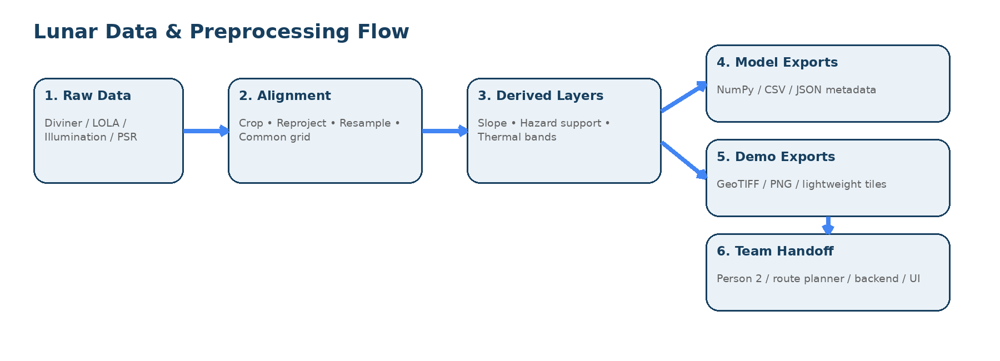
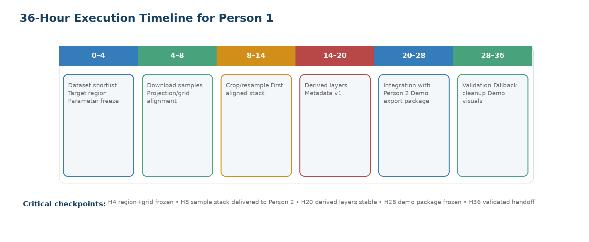

**Lunar Data & Preprocessing Engineer**

*36 Saatlik Hackathon için Ayrıntılı PDF Raporu ve Uygulama Planı*

AI-assisted lunar rover navigation / PSR-safe routing MVP

Hazırlanan kapsam: Person 1 rol tanımı, veri hattı, teslimler, riskler ve takım handoff kontratı

Temel alınan içerik: kullanıcı tarafından sağlanan metinler ve yüklenen proje brifi

**Amaç**

> Bu rapor, Ay'ın güney kutbu ve kalıcı gölgeli bölgelerinde çalışan otonom keşif araçları için geliştirilen hackathon projesinde Person 1'in tüm iş kapsamını; veri keşfi, ön işleme, katman hizalama, türetilmiş çevresel katman üretimi, takım içi entegrasyon ve demo odaklı teslimler açısından tek belgede birleştirir.

*Şekil 1. Ham veri → hizalanmış çevresel katmanlar → ekip teslimi veri akışı.*

# Yönetici Özeti

Person 1 bu projenin altyapı mühendisi rolündedir. Rover karar mekanizmasının güvenilir çalışması için sıcaklık, gölge/aydınlanma, yükseklik, eğim ve geçilebilirlik destek katmanlarını tek bir ortak grid sistemine dönüştürür. Bu iş düzgün yapılmazsa Person 2'nin thermal risk modeli, rota planlama modülü ve arayüz katmanı doğru beslenemez.

<table>
<colgroup>
<col style="width: 100%" />
</colgroup>
<thead>
<tr class="header">
<th>
<strong>Bu rapordaki ana karar 
</strong>

<ul>
<li>
Bilimsel mükemmellik yerine entegrasyon-hazır, küçük ölçekli, tekrar çalıştırılabilir bir MVP veri hattı seçilmiştir.
</li>
<li>
Birincil öneri: güney kutbu yakınında küçük bir çalışma alanı, raster/grid temsili ve ortak polar stereographic çalışma düzeni.
</li>
<li>
Çıktılar: temperature layer, elevation layer, slope layer, illumination/shadow layer, hazard-support layer, metadata sözleşmesi ve demo export paketi.
</li>
<li>
Tüm kararlar 36 saatlik hackathon baskısına göre önceliklendirilmiş, düşürülebilir ve fallback'li biçimde yazılmıştır.
</li>
</ul></th>
</tr>
</thead>
<tbody>
</tbody>
</table>

# SECTION 1 — ROLE DEFINITION

Person 1'in misyonu, Ay yüzeyine ait ham çevresel verileri ekip tarafından doğrudan kullanılabilecek işlenmiş harita katmanlarına dönüştürmektir. Kısaca bu rol; ham veriyi alır, temizler, ortak koordinat sistemine oturtur, gerekli türetilmiş katmanları üretir ve geri kalan modüllere model-ready veri sağlar.

## 1.1 Misyon

- Lunar çevresel veri katmanlarını tek bir ortak grid sistemine dönüştürmek.

- Thermal model, path planning, backend ve frontend için ortak veri tabanı oluşturmak.

- Veriyi demo sırasında güvenle gösterilebilir, hafif ve anlaşılır hale getirmek.

## 1.2 Ana sorumluluklar

| **Sorumluluk**       | **Açıklama**                                                                                            | **Çıktı**                |
|----------------------|---------------------------------------------------------------------------------------------------------|--------------------------|
| Veri keşfi           | Açık/public veri kaynaklarını seçmek; sıcaklık, topografya, illumination ve PSR maskelerini belirlemek. | Kısa veri kaynak listesi |
| Veri toplama         | Dosyaları indirmek, klasörlemek, sürümlemek, dosya isim standardı oluşturmak.                           | /data/raw yapısı         |
| Koordinat standardı  | Ortak çalışma bölgesi, çözünürlük, projeksiyon, raster shape ve nodata kuralları tanımlamak.            | grid_spec.json           |
| Ön işleme            | Crop, resample, reproject, NaN yönetimi, birim kontrolü ve hizalama.                                    | aligned raster stack     |
| Türetilmiş katmanlar | Slope, hazard-support, thermal severity band, forbidden mask gibi katmanları türetmek.                  | derived layers           |
| Export               | NumPy/CSV/GeoTIFF/JSON metadata üretmek.                                                                | /exports paketleri       |
| Dokümantasyon        | README, data dictionary, known limitations ve örnek yükleme kodu hazırlamak.                            | Handoff docs             |

## 1.3 Scope boundaries

| **In scope**                                                                 | **Out of scope**                                               |
|------------------------------------------------------------------------------|----------------------------------------------------------------|
| Küçük bir lunar south pole bölgesinde çevresel raster stack üretmek          | Küresel ölçekte yüksek hassasiyetli planetary science pipeline |
| Thermal ve routing modüllerine doğrudan bağlanacak veri formatını tanımlamak | Tam fiziksel ısı transfer simülasyonunu geliştirmek            |
| Tekrar çalıştırılabilir Python script / notebook hattı kurmak                | Tam üretim seviyesinde API servisi yazmak                      |
| Demo için hafif, görselleştirilebilir veri üretmek                           | Tüm NASA veri arşivini otomatik yöneten büyük altyapı          |
| Açık kaynak veri + hızlı doğrulama + metadata sözleşmesi                     | Bilimsel yayın kalitesinde detaylı belirsizlik analizi         |

## 1.4 36 saat sonunda başarı neye benzer?

- En az 1 hedef bölge için tüm temel katmanlar aynı shape ve koordinat sisteminde hizalanmış olmalı.

- Person 2 aynı gün içinde temperature, shadow/cold exposure ve terrain support girdilerini okuyabiliyor olmalı.

- Path planning tarafı slope/hazard/forbidden mask katmanlarını kullanarak maliyet haritası oluşturabiliyor olmalı.

- Backend ve UI için küçük, hızlı yüklenen demo export paketi hazırlanmış olmalı.

- README + metadata + limitations dokümanı sayesinde ekip verinin ne olduğunu soru sormadan anlayabilmeli.

# SECTION 2 — MVP-FIRST STRATEGY

Bu rol için doğru hackathon stratejisi 'minimum viable geospatial stack' yaklaşımıdır. Amaç en iyi veri setini bulmak değil; Person 2 ve rota planlamanın hemen kullanabileceği küçük ama teknik olarak inandırıcı bir çevresel katman setini hızlıca kilitlemektir.

| **Karar alanı**      | **Önerilen MVP yaklaşımı**                              | **Neden**                                                                |
|----------------------|---------------------------------------------------------|--------------------------------------------------------------------------|
| Çalışma alanı        | Güney kutbuna yakın tek küçük patch                     | Veri hacmini düşürür, hizalama ve demo hızını artırır.                   |
| Veri yığını          | Birincil olarak DEM + illumination/PSR + temperature    | Rota ve thermal model için minimum gerekli fiziksel bağlamı verir.       |
| Temsil               | Ortak raster/grid                                       | Entegrasyon, maliyet haritası ve görselleştirme için en basit ortak dil. |
| Türetilmiş katmanlar | Slope, hazard-support, thermal severity, forbidden mask | Diğer modüllerin doğrudan kullanacağı ara katmanlardır.                  |
| Dokümantasyon        | Kısa ama net metadata sözleşmesi                        | Takım içi bloklanmayı azaltır.                                           |
| Demo                 | Pre-rendered PNG + hafif NumPy/JSON paket               | Jüri önünde hızlı, stabil ve anlaşılır gösterim sağlar.                  |

## 2.1 Öncelik sırası

- Önce hedef bölge ve grid spec'i dondur.

- Sonra örnek veri dosyalarını indir ve ortak şekle getir.

- Ardından Person 2'ye ilk aligned stack'i ver; o bu sırada thermal risk katsayılarını geliştirsin.

- En son görsel kalite, ekstra katmanlar ve daha zengin demo export'larla ilgilen.

## 2.2 Ne ertelenmeli?

- Küresel kapsama veya birden fazla bölge karşılaştırması.

- Aşırı ince çözünürlükte tüm güney kutbu mozaiklerinin tam işlenmesi.

- Ayrıntılı zaman-serisi illumination simülasyonu.

- Gerçek zamanlı veri çekme veya tam backend tile service altyapısı.

## 2.3 Veri ağır gelirse ne mock/fake edilebilir?

- Tam sıcaklık alanı yoksa temperature proxy olarak illumination + PSR + topografik gölge kombinasyonundan oluşturulmuş relative thermal severity katmanı kullanılabilir.

- Yüksek çözünürlüklü slope ağır gelirse DEM'den daha düşük çözünürlükte yeniden türetilmiş slope kullanılabilir.

- Frontend tarafı için canlı tile map yerine önceden üretilmiş PNG overlay'ler ve küçültülmüş NumPy export kullanılabilir.

<table>
<colgroup>
<col style="width: 100%" />
</colgroup>
<thead>
<tr class="header">
<th>
<strong>Jüri önünde teknik olarak güçlü görünmek için 
</strong>

<ul>
<li>
Bir 'common grid spec' ve 'metadata contract' göstermek çok değerlidir; bu, sistem mühendisliği olgunluğu gösterir.
</li>
<li>
Birincil ve fallback veri yığınına sahip olmak, scope yönetiminin bilinçli olduğunu gösterir.
</li>
<li>
Aynı bölge üzerinde temperature-risk, slope-cost ve forbidden-mask katmanlarını üst üste göstermek anlatımı kuvvetlendirir.
</li>
</ul></th>
</tr>
</thead>
<tbody>
</tbody>
</table>

# SECTION 3 — RECOMMENDED DATA SOURCES

Aşağıdaki veri kaynakları, kullanıcı brifindeki ihtiyaçlarla resmi NASA/PDS/PGDA/LROC kaynaklarını birleştiren pratik önerilerdir. Seçim mantığı: açık erişim, güney kutup kapsaması, hızlı işlenebilirlik ve raster tabanlı entegrasyon kolaylığı.

| **Veri türü**         | **Önerilen kaynak**                                             | **Ne sağlar?**                                                           | **MVP uygunluğu**                                          | **Format / ağırlık**          | **Rol**                |
|-----------------------|-----------------------------------------------------------------|--------------------------------------------------------------------------|------------------------------------------------------------|-------------------------------|------------------------|
| Surface temperature   | Diviner Lunar Radiometer Experiment (DLRE) Gridded Data Records | Lunar yüzey sıcaklık ölçümleri ve termal bantlar.                        | Yüksek; ancak doğrudan işleme karmaşık olabilir.           | PDS ürünleri; orta-ağır       | Primary if processable |
| Elevation / DEM       | LOLA South Pole DEM Mosaic veya South Pole site LDEMs           | Yükseklik, bazı ürünlerde slope ve count maps.                           | Çok yüksek; geodetik olarak güvenilir.                     | 5 m/pix GeoTIFF; ağır         | Primary                |
| Slope                 | LOLA-derived slope products veya DEM'den türetim                | Geçilebilirlik ve maliyet için eğim.                                     | Çok yüksek; DEM varsa türetmek kolay.                      | GeoTIFF / derived raster      | Primary                |
| Illumination / shadow | PGDA Lunar Polar Illumination products                          | Uzun dönem ortalama illumination oranları ve polar visibility bilgileri. | Çok yüksek; shadow proxy için ideal.                       | PDS IMG + GeoJPEG2000; orta   | Primary                |
| PSR mask              | LROC PSR Atlas / PSR mosaics                                    | Kalıcı gölgeli bölge atlası ve bölgesel maskeler.                        | Yüksek; özellikle forbidden / high-risk zone için faydalı. | Atlas / mosaic products; orta | Optional-strong        |
| Visualization support | Moon Trek / QuickMap layers                                     | Hızlı görsel doğrulama ve demo ekran görüntüleri.                        | Yüksek; çekirdek hesap için değil gösterim için.           | WMTS / web tiles              | Optional               |

## 3.1 Nihai önerilen MVP data stack

- **Önerilen birincil stack:** LOLA DEM + DEM'den slope + PGDA illumination + PSR mask + Diviner veya proxy temperature layer.

- **Pratik yorum:** Hackathon'da en güvenli kombinasyon, DEM ve illumination katmanlarını gerçek veri olarak alıp temperature layer'ı mümkünse Diviner'dan, yetişmezse risk-proxy olarak üretmektir.

- **Neden bu seçim?** DEM ve illumination katmanları route + thermal için en açıklayıcı iki fiziksel tabandır; PSR mask ise demo anlatımını güçlendirir.

## 3.2 Fallback stack

- South pole küçük bir DEM patch + DEM'den slope + PSR atlas maskesi + illumination-derived thermal severity proxy.

- Bu fallback senaryoda temperature katmanı mutlak Kelvin alanı olmak zorunda değildir; relatif 0–1 veya 0–100 risk bandı olarak sunulabilir.

- Fallback yaklaşımı özellikle veri indirme veya format dönüştürme gecikirse projenin çökmesini engeller.

## 3.3 Veri kaynağı seçimi için mühendislik notu

Person 1 mutlak veri doğruluğunu değil, uyumlu ve tekrar edilebilir çevresel stack'i hedeflemelidir. Yani 'en iyi veri seti' yerine 'en hızlı entegre edilen, en az sürpriz çıkaran veri seti' seçilmelidir.

# SECTION 4 — REGION AND RESOLUTION DECISIONS

| **Karar**             | **Öneri**                                                                                           | **Gerekçe**                                                                  |
|-----------------------|-----------------------------------------------------------------------------------------------------|------------------------------------------------------------------------------|
| Hedef bölge           | Lunar south pole yakınında tek küçük patch; ör. Shackleton çevresi veya yakın bir kutup alt-bölgesi | PSR ve illumination etkisini güçlü biçimde gösterir; jüri anlatımı kolaydır. |
| Bölge boyutu          | Yaklaşık 10x10 km ile 20x20 km arası ilk çalışma alanı                                              | Hem rota üretmek için yeterli hem de hafif işlenebilir.                      |
| Temsil                | 2D raster/grid                                                                                      | Thermal, hazard ve routing modülleri için ortak numerik taban sağlar.        |
| Önerilen çözünürlük   | İlk deneme 20–60 m/pixel; yalnızca gerekirse daha ince                                              | 5 m ürünler ağır olabilir; downsample ile hız korunur.                       |
| Veri küçültme yöntemi | Önce crop, sonra gerekiyorsa resample/downsample                                                    | Gereksiz global veri yükünü ortadan kaldırır.                                |
| Hizalama kuralı       | Tüm katmanlar aynı extent, same CRS, same resolution, same origin, same shape                       | Takım içi bugs ve silent misalignment hatalarını engeller.                   |

Bu raporun tavsiyesi nettir: güney kutbu yakınında tek bir küçük çalışma alanı seçin, tüm katmanları ortak raster shape'e getirin ve yüksek çözünürlüklü orijinal veriyi sadece kaynak olarak saklayın. Analiz ve demo için downsample edilmiş aligned stack kullanın.

<table>
<colgroup>
<col style="width: 100%" />
</colgroup>
<thead>
<tr class="header">
<th>
<strong>Pratik region kararı 
</strong>

<ul>
<li>
İlk 4 saat içinde bölge adı, bounding box, target CRS ve target pixel size dondurulmalıdır.
</li>
<li>
Bölge kararı dondurulmadan veri işleme başlatmak, hackathon boyunca katmanların yeniden işlenmesine ve zaman kaybına neden olur.
</li>
</ul></th>
</tr>
</thead>
<tbody>
</tbody>
</table>

# SECTION 5 — DETAILED TASK BREAKDOWN

*Şekil 2. Person 1 için 36 saatlik yürütme zaman çizelgesi.*

| **Faz**    | **Öncelik** | **Mutlaka yapılacaklar**                                                                                    | **Beklenen çıktı**                                               | **Zaman kalırsa**           | **Person 2 entegrasyonu**                                         |
|------------|-------------|-------------------------------------------------------------------------------------------------------------|------------------------------------------------------------------|-----------------------------|-------------------------------------------------------------------|
| Hour 0–4   | Critical    | Veri kaynaklarını daralt; target region ve grid spec dondur; klasör yapısını aç; ilk örnek dosyaları indir. | Veri kaynak kısa listesi, grid_spec.json taslağı, raw klasörleri | Opsiyonel ekran görüntüleri | Person 2 ile sıcaklık/risk ölçeği ve çalışma bölgesi ortak kararı |
| Hour 4–8   | Critical    | Projeksiyon, crop ve resample iskeletini kur; en az iki katmanı aynı shape'e getir.                         | İlk aligned DEM + illumination                                   | Ek QA notları               | Person 2'ye ilk raster stack ver; risk formülü mock başlayabilir  |
| Hour 8–14  | Critical    | Slope üret; nodata stratejisini netleştir; metadata v1 oluştur; validation plot üret.                       | aligned/ ve derived/ klasörlerinin ilk sürümü                    | PSR mask integrasyonu       | Person 2 thermal severity hesabını gerçek grid üzerinde dener     |
| Hour 14–20 | Important   | Temperature layer veya temperature proxy üret; hazard-support ve forbidden mask hazırla.                    | temperature_layer, hazard_support, forbidden_mask                | İkinci demo patch           | Thermal risk ve route cost input contract dondurulur              |
| Hour 20–28 | Important   | Export paketlerini oluştur; backend/frontend için hafif versiyon çıkar; README yaz.                         | model_input/ ve demo/ export paketi                              | Tile-benzeri PNG setleri    | Backend ve frontend örnek yükleme testi                           |
| Hour 28–36 | Critical    | Tam kalite kontrol; tüm shape ve unit kontrolleri; fallback temizliği; final docs ve demo görselleri.       | Final teslim klasörü                                             | Ek görsel süsleme           | Person 2 ve rota modülü ile son dry-run                           |

## 5.1 Mikro görev listesi

| **Alt iş**                               | **Bağımlılık**           | **Öncelik** | **Beklenen çıktı**        |
|------------------------------------------|--------------------------|-------------|---------------------------|
| Kullanılabilir veri kaynaklarını listele | Yok                      | Critical    | data_sources_shortlist.md |
| Lisans/açık erişim ve formatı kontrol et | Kaynak listesi           | Important   | source_notes.md           |
| Ham veri klasörlerini oluştur            | Yok                      | Critical    | /data/raw/\*              |
| Dosya isim standardını yaz               | Yok                      | Important   | naming_rules.md           |
| Target region bbox belirle               | Takım kararı             | Critical    | grid_spec.json            |
| CRS ve pixel size belirle                | Bölge kararı             | Critical    | grid_spec.json            |
| Örnek DEM indir                          | Kaynak seçimi            | Critical    | raw/elevation/\*          |
| Örnek illumination indir                 | Kaynak seçimi            | Critical    | raw/illumination/\*       |
| Reproject + crop script yaz              | Grid spec                | Critical    | preprocess_data.py        |
| Slope map hesapla                        | Aligned DEM              | Critical    | derived/slope\_\*         |
| PSR mask veya forbidden mask çıkar       | Aligned PSR/illumination | Important   | derived/forbidden\_\*     |
| Temperature/proxy katmanı üret           | Thermal assumptions      | Important   | derived/temperature\_\*   |
| Validation görselleri üret               | Aligned layers           | Important   | validation PNG seti       |
| Data dictionary yaz                      | Katman isimleri          | Critical    | docs/data_dictionary.md   |
| Export script yaz                        | Final katmanlar          | Critical    | export_demo_data.py       |

# SECTION 6 — PERSON 1 AND PERSON 2 COLLABORATION

Person 1 ve Person 2 sıkı bağlı modüller geliştirir; ama birbirlerini bloklamamaları gerekir. En iyi yöntem, arayüzleri erken dondurup katman isimleri, shape, birimler ve risk yorumunu ortak bir sözleşmeye bağlamaktır.

| **Konu**              | **Person 1 sağlar**                                 | **Person 2 sağlar / ister**                 | **Ne zaman dondurulmalı?** |
|-----------------------|-----------------------------------------------------|---------------------------------------------|----------------------------|
| Temperature interface | temperature_grid veya temperature_proxy_grid        | thermal tolerance eşikleri ve risk dönüşümü | İlk 4–8 saat               |
| Shadow / illumination | illumination_fraction ve/veya shadow_duration_proxy | cold exposure etkisinin nasıl yorumlanacağı | İlk 8 saat                 |
| Terrain inputs        | elevation, slope, hazard_support, forbidden_mask    | terrain kaynaklı risk katsayıları           | İlk 14 saat                |
| Metadata              | grid spec, nodata, units, normalization bilgisi     | hangi alanları zorunlu okuyacağını belirtir | İlk 8 saat                 |
| Validation            | örnek patch ve kontrol görselleri                   | risk haritası overlay sonuçları             | 20\. saat civarı           |

## 6.1 Erken dondurulması gereken arayüzler

- target_shape (rows, cols)

- target_crs veya en azından kullanılan çalışma referansı

- pixel_size_m

- nodata değeri ve NaN politikası

- temperature ve risk birimlerinin yorumu

- forbidden mask mantığı: 1 yasak mı, 0 yasak mı?

- slope değerinin derece mi normalized cost mu olduğu

## 6.2 Shared parameter sheet

<table>
<colgroup>
<col style="width: 100%" />
</colgroup>
<thead>
<tr class="header">
<th>project_region_name: south_pole_patch_A 
bbox: [xmin, ymin, xmax, ymax] 
crs: south_polar_stereographic 
pixel_size_m: 40 
target_shape: [512, 512] 
nodata_value: -9999 
temperature_unit: K_or_relative_risk 
risk_scale: 0_to_1 
slope_unit: degree 
mask_convention: 1=valid_traversable, 0=blocked 
export_version: v1</th>
</tr>
</thead>
<tbody>
</tbody>
</table>

## 6.3 Shared metadata contract

Her katman için en az şu alanlar zorunlu olmalıdır: layer_name, source, units, shape, resolution_m, nodata_value, normalization, valid_range, creation_step, assumptions, limitations.

## 6.4 Naming convention

<table>
<colgroup>
<col style="width: 100%" />
</colgroup>
<thead>
<tr class="header">
<th>raw_&lt;source&gt;_&lt;region&gt;_&lt;resolution&gt;.&lt;ext&gt; 
aligned_&lt;layer&gt;_&lt;region&gt;_&lt;mpp&gt;.tif 
derived_&lt;layer&gt;_&lt;region&gt;_&lt;mpp&gt;.npy 
export_&lt;audience&gt;_&lt;region&gt;_&lt;version&gt;.zip 
 
Örnek: 
aligned_elevation_spole_patchA_40m.tif 
derived_slope_spole_patchA_40m.npy 
export_demo_spole_patchA_v1.zip</th>
</tr>
</thead>
<tbody>
</tbody>
</table>

# SECTION 7 — PREPROCESSING PIPELINE DESIGN

## 7.1 Önerilen klasör yapısı

<table>
<colgroup>
<col style="width: 100%" />
</colgroup>
<thead>
<tr class="header">
<th>/data 
/raw 
/temperature 
/elevation 
/illumination 
/psr 
/intermediate 
/cropped 
/reprojected 
/processed 
/aligned 
/derived 
/exports 
/demo 
/model_input 
/frontend_light 
 
/notebooks 
01_data_exploration.ipynb 
02_alignment.ipynb 
03_derived_layers.ipynb 
04_validation.ipynb 
 
/scripts 
download_data.py 
preprocess_data.py 
build_layers.py 
export_demo_data.py 
validate_layers.py 
 
/docs 
README.md 
data_dictionary.md 
preprocessing_notes.md 
known_limitations.md 
source_notes.md</th>
</tr>
</thead>
<tbody>
</tbody>
</table>

## 7.2 Python araç yığını

| **Araç**         | **Rol**                                           | **Zorunluluk**  |
|------------------|---------------------------------------------------|-----------------|
| Python           | Tüm pipeline omurgası                             | Zorunluya yakın |
| NumPy            | Raster array işleme, hızlı export                 | Zorunlu         |
| Pandas           | Metadata, data dictionary ve tablo üretimi        | Zorunlu         |
| Rasterio         | GeoTIFF okuma/yazma, crop, reprojection           | Zorunlu         |
| xarray           | NetCDF veya çok boyutlu veri işleme               | Faydalı         |
| matplotlib       | Hızlı validation ve demo görselleri               | Zorunluya yakın |
| Jupyter Notebook | Exploration ve hızlı doğrulama                    | Faydalı         |
| GDAL             | Format dönüştürme ve sağlam geospatial utiliteler | Çok faydalı     |
| geopandas        | ROI ve shapefile işi varsa                        | Opsiyonel       |
| QGIS             | Görsel kontrol ve sanity check                    | Çok faydalı     |

## 7.3 Pipeline aşamaları

| **Aşama** | **Ne yapar?**                                                             | **Doğrulama**                                    |
|-----------|---------------------------------------------------------------------------|--------------------------------------------------|
| Discovery | Kaynak seçimi, erişim yöntemi, dosya formatı, lisans notu.                | Kaynak listesi ve örnek dosya indirimi tamam mı? |
| Ingest    | Ham verileri indirir, klasörler, isim standardı uygular.                  | Dosyalar açılıyor mu, boyutlar makul mü?         |
| Grid spec | Bölge, çözünürlük, CRS, extent ve target shape tanımlar.                  | grid_spec.json sabit mi?                         |
| Transform | Crop, reproject, resample, nodata yönetimi ve same-shape alignment yapar. | Tüm rasterlar aynı shape ve affine'e sahip mi?   |
| Derive    | Slope, hazard support, thermal severity, forbidden mask üretir.           | Min/max ve mantık kontrolleri doğru mu?          |
| Export    | Model, backend, frontend ve demo için farklı paketler çıkarır.            | Okuma örneği ve metadata mevcut mu?              |
| Validate  | Sayısal, görsel ve entegrasyon kontrolleri.                               | Definition of Done maddeleri geçiyor mu?         |

## 7.4 Shape alignment strategy

- Tek bir target grid seçilir; diğer bütün katmanlar buna uydurulur.

- Extent, affine transform, pixel size ve row/col sayıları tüm aligned katmanlar için birebir aynı tutulur.

- Her export öncesi otomatik shape assertion çalıştırılır.

- GeoTIFF tarafında aynı CRS ve metadata korunur; NumPy export'ta metadata JSON ile eşlenir.

## 7.5 Missing value ve normalization kararları

- Ham nodata değerleri tek bir ortak nodata_value'ya çevrilmelidir; ör. -9999.

- Analitik hesaplarda NaN kullanmak daha güvenli olabilir; export öncesi metadata ile birlikte açıkça belirtilmelidir.

- Model-ready katmanlarda iki seviye sunulabilir: raw physical units ve normalized 0–1 risk/cost türevi.

- UI için renk skalası ve legend önerileri ayrı bir JSON veya markdown notunda verilmelidir.

## 7.6 Demo-ready export

Demo için ayrı bir hafif paket üretilmelidir. Bu paket, tam doğruluk yerine hızlı açılma ve görsel anlatımı önceler. Öneri: küçültülmüş GeoTIFF/NumPy seti, her katman için bir PNG önizleme, kısa legend notu ve tek dosyalık metadata JSON.

# SECTION 8 — DELIVERABLES

| **Teslim**                      | **Zorunlu / Stretch** | **Dosya örneği**                            | **Kime gider?**        |
|---------------------------------|-----------------------|---------------------------------------------|------------------------|
| Temperature layer               | Zorunlu               | derived_temperature_spole_patchA_40m.npy    | Person 2, backend      |
| Elevation layer                 | Zorunlu               | aligned_elevation_spole_patchA_40m.tif      | Path planning, backend |
| Slope layer                     | Zorunlu               | derived_slope_spole_patchA_40m.npy          | Path planning          |
| Illumination / shadow layer     | Zorunlu               | aligned_illumination_spole_patchA_40m.tif   | Person 2, UI           |
| Hazard-support / forbidden mask | Zorunlu               | derived_forbidden_mask_spole_patchA_40m.npy | Path planning          |
| grid_spec + metadata            | Zorunlu               | grid_spec.json, layer_metadata.json         | Herkes                 |
| README + data dictionary        | Zorunlu               | docs/README.md                              | Herkes                 |
| Validation plots                | Important             | validation_overview.png                     | Jüri, takım            |
| Frontend-light package          | Stretch               | export_frontend_light_spole_patchA_v1.zip   | UI                     |
| Ek demo görselleri              | Stretch               | legend_cards.png                            | Jüri sunumu            |

## 8.1 Final demo'da ne gösterilmeli?

- Seçilen lunar patch üzerinde base elevation/slope haritası.

- Aynı patch üzerinde illumination/shadow ve temperature-risk overlay.

- Forbidden mask ve traversability support map.

- Aynı grid üzerinde Person 2'nin thermal risk çıktısı ve rota planlayıcının güvenli rota sonucu.

- Kısa bir 'data lineage' slaytı: ham veri → aligned grid → derived layers → decision modules.

# SECTION 9 — VALIDATION AND QUALITY CHECKLIST

| **Kontrol tipi**  | **Ne kontrol edilir?**                                                   | **Hızlı yakalama yöntemi**                |
|-------------------|--------------------------------------------------------------------------|-------------------------------------------|
| Numerical         | Min/max değerler, beklenen aralıklar, negative slope gibi saçma durumlar | summary_stats.csv ve assertion script     |
| File              | Dosya var mı, açılıyor mu, bozuk mu, beklenen formatta mı                | os.path + raster open smoke test          |
| Shape consistency | Tüm katmanlar aynı rows/cols/transform'a sahip mi                        | validate_layers.py ile otomatik assertion |
| Visual            | Katman görüntüsü mantıklı mı, ters çevrilmiş veya kaymış mı              | matplotlib/QGIS ile yan yana plot         |
| Sanity            | PSR ile düşük illumination bölgeleri genel olarak tutarlı mı             | overlay kontrolü                          |
| Integration       | Person 2 dosyaları doğrudan okuyabiliyor mu                              | örnek load script ve ortak test           |
| Metadata          | Units, nodata, normalization bilgisi eksiksiz mi                         | JSON schema kontrolü                      |

## 9.1 Common mistakes ve hızlı yakalama yöntemleri

- CRS aynı görünüyor ama affine origin farklı olabilir; sadece shape kontrolü yetmez.

- Slope degree ile normalized slope cost karıştırılabilir; dosya isminde ve metadata'da açık yazılmalıdır.

- Nodata alanları hesapta gerçek 0 değeri gibi davranabilir; özellikle mask ve normalization aşamasında dikkat edilmelidir.

- Frontend'e ham büyük GeoTIFF vermek performansı çökertebilir; mutlaka light export üretin.

- Person 2 relative risk beklerken fiziksel Kelvin vermek veya tam tersini yapmak entegrasyonu kırar.

## 9.2 Definition of Done

- Tüm zorunlu katmanlar mevcut.

- Tüm aligned katmanlar aynı grid spec'e uyuyor.

- Data dictionary ve README tamam.

- En az bir validation görseli mevcut.

- Person 2 örnek dosyaları okuyup risk hesaplayabiliyor.

- Backend/UI için hafif demo paketi hazır.

- Known limitations açıkça yazılmış.

# SECTION 10 — RISK MANAGEMENT

| **Risk**               | **Neden olur?**                                  | **Şiddet** | **Erken işaret**                      | **Mitigation**                               | **Fallback**                                             |
|------------------------|--------------------------------------------------|------------|---------------------------------------|----------------------------------------------|----------------------------------------------------------|
| Veri çok büyük         | South pole ürünleri GB seviyesinde olabilir      | Yüksek     | İndirme ve işlem süresi uzar          | Küçük patch seç, crop-first yaklaşımı uygula | Downsample + proxy katman                                |
| Format karmaşık        | PDS IMG/JP2/özel metadata sürpriz çıkarabilir    | Yüksek     | Dosya açma hataları                   | İlk saatlerde örnek dosya smoke test yap     | GeoTIFF/PNG tabanlı alternatif kaynak veya ön-export     |
| Katmanlar hizalanmıyor | Farklı extent, CRS, pixel origin                 | Çok yüksek | Overlay kayması                       | Başta tek grid spec dondur                   | Daha az katmanla devam et ama hizalı stack'i koru        |
| Missing values fazla   | Polar veri coverage ve shadow kaynaklı boşluklar | Orta       | NaN alanlar büyük lekeler oluşturur   | Mask ve nodata politikası yaz                | Boş alanı riskli kabul eden conservative mask            |
| Birimler belirsiz      | Temperature/risk/slope farklı yorumlanabilir     | Yüksek     | Person 2 sonuçları anlamsız çıkar     | Shared parameter sheet kullan                | Kelvin yerine açıkça proxy risk bandı sun                |
| Zaman yetmiyor         | Hackathon baskısı ve teknik sürprizler           | Çok yüksek | 14\. saate kadar ilk stack çıkmıyorsa | Öncelik kırp, optional işleri at             | DEM + slope + illumination + proxy temperature ile bitir |
| Person 2 ile bloklanma | Arayüzler geç dondurulur                         | Yüksek     | Sürekli dosya formatı değişiyor       | Erken metadata contract                      | Stable v1 export dondur ve sonradan sadece ek dosya ekle |

# SECTION 11 — TOOLING RECOMMENDATIONS

Aşırı zaman baskısında Person 1'in amaç fonksiyonu 'en güzel mimari' değil 'en düşük sürprizli, en hızlı çalışan geospatial workflow' olmalıdır.

| **Alan**         | **Öneri**                                         | **Kaçınılması gereken**                                    |
|------------------|---------------------------------------------------|------------------------------------------------------------|
| Dil              | Python                                            | Hackathon ortasında çok dilli karma pipeline               |
| Ana kütüphaneler | NumPy, Pandas, Rasterio, matplotlib               | Aynı işi yapan gereksiz fazla geospatial wrapper           |
| Opsiyonel        | xarray, GDAL, geopandas, QGIS                     | Kurulumu problemli ağır görsel araçlara gömülmek           |
| Çalışma biçimi   | Notebook ile keşif + script ile tekrar çalıştırma | Sadece notebook'ta kalan, otomasyonsuz süreç               |
| Sürümleme        | Git + net klasör yapısı + export version etiketi  | İsimsiz dosyalar ve karışık final klasörü                  |
| Format           | GeoTIFF + NPY + JSON + CSV                        | Hackathon'da nadir ve kırılgan formatlara aşırı bağımlılık |

## 11.1 Notebook vs script tavsiyesi

- Notebook: veri keşfi, ilk görsel kontrol, prototip hesap ve screenshot üretimi için kullan.

- Script: preprocess, build_layers, export, validate adımlarını tekrar çalıştırılabilir yapmak için kullan.

- Final teslim, scripts/ klasöründen uçtan uca çalıştırılabilen bir pipeline iskeleti içermelidir.

# SECTION 12 — TEAM HANDOFF CONTRACT

Aşağıdaki sözleşme, Person 1'in diğer modüllere ne teslim ettiğini ve bu verinin nasıl yorumlanacağını açıkça tanımlar. Bu bölüm mini bir mühendislik arayüz spesifikasyonu gibi okunmalıdır.

| **Alan**        | **Zorunlu açıklama**                                                          |
|-----------------|-------------------------------------------------------------------------------|
| Export package  | Person 1 en az bir model_input paketi ve bir demo paketi teslim eder.         |
| Layer semantics | Her dosyanın neyi temsil ettiği README ve metadata JSON'da açıklanır.         |
| Units           | Temperature, slope, elevation, illumination ve mask birimleri açıkça yazılır. |
| Valid ranges    | Beklenen minimum/maximum aralıklar verilir.                                   |
| Nodata policy   | Eksik alanların nasıl temsil edildiği ve nasıl yorumlanacağı belirtilir.      |
| Assumptions     | Temperature proxy kullanıldıysa veya downsample yapıldıysa açıkça belirtilir. |
| Limitations     | Çözünürlük, coverage ve bilimsel doğruluk sınırları dürüstçe yazılır.         |
| Load pattern    | Diğer modüllerin örnek Python koduyla paketi nasıl okuyacağı gösterilir.      |

## 12.1 Örnek metadata şeması

<table>
<colgroup>
<col style="width: 100%" />
</colgroup>
<thead>
<tr class="header">
<th>{ 
"layer_name": "slope", 
"region_name": "south_pole_patch_A", 
"source": "LOLA DEM derived", 
"units": "degree", 
"shape": [512, 512], 
"pixel_size_m": 40, 
"crs": "south_polar_stereographic", 
"nodata_value": -9999, 
"valid_range": [0, 45], 
"normalization": "none", 
"assumptions": [ 
"derived from downsampled DEM", 
"cropped to demo ROI" 
], 
"limitations": [ 
"not suitable for science-grade slope uncertainty analysis" 
] 
}</th>
</tr>
</thead>
<tbody>
</tbody>
</table>

## 12.2 Örnek minimal load script

<table>
<colgroup>
<col style="width: 100%" />
</colgroup>
<thead>
<tr class="header">
<th>import json 
import numpy as np 
from pathlib import Path 
 
root = Path("data/exports/model_input") 
meta = json.loads((root / "layer_metadata.json").read_text(encoding="utf-8")) 
slope = np.load(root / "derived_slope_spole_patchA_40m.npy") 
temp = np.load(root / "derived_temperature_spole_patchA_40m.npy") 
 
assert tuple(meta["slope"]["shape"]) == slope.shape 
assert tuple(meta["temperature"]["shape"]) == temp.shape</th>
</tr>
</thead>
<tbody>
</tbody>
</table>

# SECTION 13 — EXECUTION CHEAT SHEET

<table>
<colgroup>
<col style="width: 100%" />
</colgroup>
<thead>
<tr class="header">
<th>
<strong>En hızlı başarı yolu 
</strong>

<ul>
<li>
1) Bölge + grid spec'i erken dondur.
</li>
<li>
2) DEM ve illumination'ı aynı shape'e getir.
</li>
<li>
3) DEM'den slope türet.
</li>
<li>
4) Person 2'ye ilk stack'i hemen ver; perfect olmasını bekleme.
</li>
<li>
5) Temperature yetişmezse proxy thermal severity üret.
</li>
<li>
6) Finalde metadata + README ile teslimi profesyonelleştir.
</li>
</ul></th>
</tr>
</thead>
<tbody>
</tbody>
</table>

## 13.1 Top priorities

- Common grid system

- Aligned core layers

- Derived slope + hazard-support

- Stable handoff to Person 2

- Validation + documentation

## 13.2 Top avoidable mistakes

- Bölge ve çözünürlük kararı vermeden veri işleme başlamak

- Aynı isimle farklı unit'lerde dosya üretmek

- Frontend'e çok ağır dosya teslim etmek

- README ve metadata'yı sona bırakıp hiç yazmamak

- Katmanların sadece shape'ini kontrol edip coğrafi hizalamasını kontrol etmemek

## 13.3 Zaman çöküyorsa ne yapılmalı?

- Tek bölgeye düş.

- Tek çözünürlüğe düş.

- Temperature'ı proxy risk katmanı yap.

- Tile servis fikrini bırak; PNG overlay ile demo yap.

- Sadece zorunlu 5 katman + metadata + kısa README ile bitir.

## 13.4 Minimum successful demo paketi

- aligned_elevation

- derived_slope

- aligned_illumination veya shadow proxy

- derived_temperature_proxy

- derived_forbidden_mask veya hazard_support

- grid_spec.json

- layer_metadata.json

- 1 adet validation figure

- 1 adet README

# APPENDIX A — Suggested Final Folder Snapshot

<table>
<colgroup>
<col style="width: 100%" />
</colgroup>
<thead>
<tr class="header">
<th>final_delivery/ 
docs/ 
README.md 
data_dictionary.md 
preprocessing_notes.md 
known_limitations.md 
exports/ 
model_input/ 
aligned_elevation_spole_patchA_40m.tif 
aligned_illumination_spole_patchA_40m.tif 
derived_slope_spole_patchA_40m.npy 
derived_temperature_spole_patchA_40m.npy 
derived_forbidden_mask_spole_patchA_40m.npy 
layer_metadata.json 
grid_spec.json 
demo/ 
elevation_preview.png 
slope_preview.png 
illumination_preview.png 
thermal_risk_preview.png 
legend_notes.md</th>
</tr>
</thead>
<tbody>
</tbody>
</table>

# APPENDIX B — Official Source Basis Used for Data-Source Recommendations

- \[R1\] NASA PDS — LRO DLRE Level 5 GDR. Diviner gridded records for lunar temperature mapping.

- \[R2\] LOLA PDS Data Node / PGDA — South pole DEM products, slope maps and archive documentation.

- \[R3\] PGDA Lunar Polar Illumination — polar illumination products for south and north poles; PDS IMG and GeoJPEG2000 distribution.

- \[R4\] PGDA High-Resolution LOLA Topography for Lunar South Pole Sites — 5 m/pix GeoTIFF products including elevation and slope.

- \[R5\] PGDA South Pole LOLA DEM Mosaic — 87–90°S mosaic with GeoTIFF height and slope products.

- \[R6\] LROC Permanently Shadowed Regions Atlas — PSR atlas and associated south pole PSR mosaics.

- \[R7\] NASA Moon Trek / QuickMap — optional rapid visual exploration and tile-style visualization support.

# APPENDIX C — This report's synthesis logic

Bu belge; kullanıcının Türkçe rol tanımı, görev kırılımı, risk listesi, klasör önerileri ve ekip bağlantıları ile yüklenen İngilizce kapsam brifini tek, detaylı, profesyonel ve hackathon-executable raporda birleştirir.
